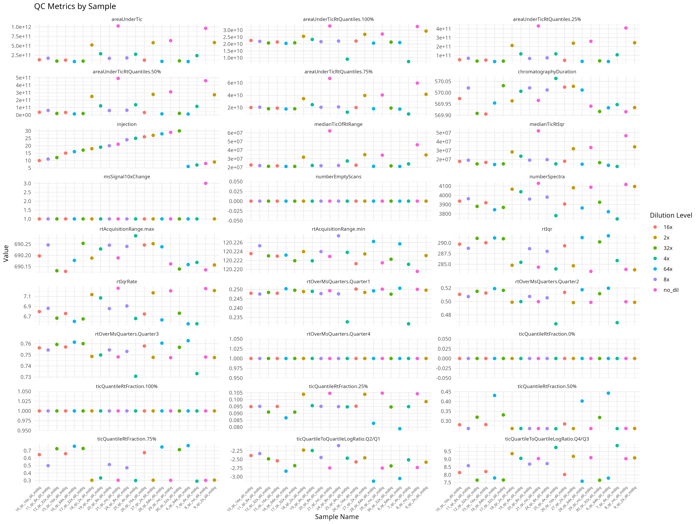

# Hands-on III - MzQC tutorial

## Resources

- msQuality python environment: [environment.yaml](./mzqc/environment.yaml)
- Sample dataset example: [sampleData.tsv](./mzqc/sampleData.tsv)
- tutorial script: [tutorial.R](./mzqc/tutorial.R)

## Tutorial

Based on [the msQuality Vignette](https://bioconductor.org/packages/release/bioc/vignettes/MsQuality/inst/doc/MsQuality.html)

```R
library("Spectra")
library("MsExperiment")
library("MsQuality")
library("ggplot2")
library("tidyr")

str_split <- function(x) {
  stringr::str_split(x, '\\.')[[1]][1]
}

drop_na_cols <- function(df) {
  as.data.frame(df[, colSums(is.na(df)) == 0])
}

download_url_files <- function(sd_df) {
  urls <- sd_df[["url"]]
  filenames <- sd[["sample_name"]]
  tmp_dir <- tempdir()
  local_paths <- file.path(tmp_dir, paste0(filenames, ".mzml"))

  for (i in seq_along(urls)) {
    utils::download.file(urls[i], local_paths[i], mode = "wb", quiet = TRUE)
  }

  local_paths
}

sd <- read.csv2("sampleData.tsv", sep = "\t", header=TRUE)
paths <- download_url_files(sd, "url")

spectra_obj <- Spectra(paths, backend = MsBackendMzR())

lmse <- MsExperiment()
sampleData(lmse) <- DataFrame(sd)
experimentFiles(lmse) <- MsExperimentFiles(mzML_files = paths)
spectra(lmse) <- spectra_obj
lmse <- linkSampleData(
    lmse,
    with = "experimentFiles.mzML_file",
    withIndex = seq_len(21)
)

metrics <- calculateMetrics(
    object = lmse,
    metrics = qualityMetrics(lmse),
    filterEmptySpectra = FALSE,
    msLevel = 1L
)

md <- drop_na_cols(metrics)
md$sample_name <- basename(rownames(md)) |> sapply(str_split)


# Plot all metrics by sample ID, colored by dilution level
plot_data <- merge(x=md, y=sd, by="sample_name", all=TRUE)

# Get numeric columns (excluding sample_name, dilution, injection)
numeric_cols <- names(plot_data)[sapply(plot_data, is.numeric)]

# Create a long format dataframe for plotting
plot_data_long <- plot_data %>%
  pivot_longer(
    cols = all_of(numeric_cols),
    names_to = "metric",
    values_to = "value"
  )

# Create faceted plots for all metrics
p <- ggplot(plot_data_long, aes(x = sample_name, y = value, color = dilution)) +
  geom_point(size = 2) +
  facet_wrap(~metric, scales = "free_y", ncol = 3) +
  theme_minimal() +
  theme(
    axis.text.x = element_text(angle = 45, hjust = 1, size = 6),
    strip.text = element_text(size = 8)
  ) +
  labs(
    title = "QC Metrics by Sample",
    x = "Sample Name",
    y = "Value",
    color = "Dilution Level"
  )

# Save the plot to file
ggsave("all_metrics_plot.png", plot = p, width = 16, height = 12)

mzqc_metrics <- calculateMetricsFromSpectra(
    spectra_obj,
    metrics = qualityMetrics(spectra_obj),
    format="mzQC"
)

rmzqc::writeMZQC("metrics.mzqc", mzqc_metrics)


```

## Results
- mzqc json file output: [metrics.mzqc](./mzqc/metrics.mzqc)

```json
[
	{
    "mzQC": {
      "version": "0.7.0",
      "creationDate": "2026-02-17T09:54:41Z",
      "contactName": "hechth",
      "description": "A mzQC document on the sample 6_qc_64x_dil_milliq.mzml",
      "runQualities": [
        {
          "metadata": {
            "label": "/tmp/RtmpN7kIL0/6_qc_64x_dil_milliq.mzml",
            "inputFiles": [
              {
                "name": "6_qc_64x_dil_milliq.mzml",
                "location": "file:////tmp/RtmpN7kIL0/6_qc_64x_dil_milliq.mzml",
                "fileFormat": {
                  "accession": "MS:1000584",
                  "name": "mzML format"
                }
              }
            ],
            "analysisSoftware": [
              {
                "accession": "MS:4000151",
                "name": "MsQuality",
                "version": "1.11.0",
                "uri": "https://github.com/tnaake/MsQuality/",
                "description": "\"MsQuality – an interoperable open-source package for the calculation of standardized quality metrics of mass spectrometry data.\" [DOI:10.1101/2023.05.12.540477, https://github.com/tnaake/MsQuality/]"
              }
            ]
          },
          "qualityMetrics": [
            {
              "accession": "MS:4000053",
              "name": "chromatography duration",
              "description": "\"The retention time duration of the chromatography in seconds.\" [PSI:MS]",
              "value": 569.9332
            },
            {
              "accession": "MS:4000183",
              "name": "TIC quantile RT fraction",
              "description": "\"The interval when the respective quantile of the TIC accumulates divided by retention time duration. The number of values in the tuple implies the quantile mode.\" [PSI:MS]",
              "value": 0
            },
            {
              "accession": "MS:4000055",
              "name": "obsolete MS1 quarter RT fraction",
              "description": "\"OBSOLETE. The interval used for acquisition of the first, second, third, and fourth quarter of all MS1 events divided by retention time duration.\" [PSI:MS]",
              "value": 0.2506
            },
            {
              "accession": "MS:4000057",
              "name": "obsolete MS1 TIC-change quartile ratios",
              "description": "\"OBSOLETE. The log ratios of successive TIC-change quartiles. The TIC changes are the list of MS1 total ion current (TIC) value changes from one to the next scan, produced when each MS1 TIC is subtracted from the preceding MS1 TIC. The metric's value triplet represents the log ratio of the TIC-change Q2 to Q1, Q3 to Q2, TIC-change-max to Q3\" [PSI:MS]",
              "value": -3.0509
            },
            {
              "accession": "MS:4000059",
              "name": "number of MS1 spectra",
              "description": "\"The number of MS1 events in the run.\" [PSI:MS]",
              "value": 3823
            },
            {
              "accession": "MS:4000099",
              "name": "number of empty MS1 scans",
              "description": "\"Number of MS1 scans where the scans' peaks intensity sums to 0 (i.e. no peaks or only 0-intensity peaks).\" [PSI:MS]",
              "value": 0
            },
            {
              "accession": "MS:4000155",
              "name": "area under TIC",
              "description": "\"The area under the total ion chromatogram.\" [PSI:MS]",
              "value": 82324299604.8835
            },
            {
              "accession": "MS:4000156",
              "name": "area under TIC RT quantiles",
              "description": "\"The area under the total ion chromatogram of the retention time quantiles. Number of quantiles are given by the n-tuple.\" [PSI:MS]",
              "value": 30642537197.4471
            },
            {
              "accession": "MS:4000069",
              "name": "m/z acquisition range",
              "description": "\"Upper and lower limit of m/z precursor values at which MSn spectra are recorded.\" [PSI:MS]"
            },
            {
              "accession": "MS:4000070",
              "name": "retention time acquisition range",
              "description": "\"Upper and lower limit of retention time at which spectra are recorded.\" [PSI:MS]",
              "value": 120.2257
            },
            {
              "accession": "MS:4000160",
              "name": "MS2 precursor intensity range",
              "description": "\"Minimum and maximum MS2 precursor intensity recorded.\" [PSI:MS]"
            },
            {
              "accession": "MS:4000116",
              "name": "MS2 precursor intensity distribution",
              "description": "\"From the distribution of MS2 precursor intensities, the quantiles. E.g. a value triplet represents the quartiles Q1, Q2, Q3.\" [PSI:MS]"
            },
            {
              "accession": "MS:4000117",
              "name": "MS2 precursor intensity distribution mean",
              "description": "\"From the distribution of MS2 precursor intensities, the mean\" [PSI:MS]"
            },
            {
              "accession": "MS:4000118",
              "name": "MS2 precursor intensity distribution sigma",
              "description": "\"From the distribution of MS2 precursor intensities, the sigma value\" [PSI:MS]"
            },
            {
              "accession": "MS:4000097",
              "name": "MS1 signal jump (10x) count",
              "description": "\"The number of times where MS1 TIC increased more than 10-fold between adjacent MS1 scans.\" [PSI:MS]",
              "value": 1
            },
            {
              "accession": "MS:4000167",
              "name": "ratio of 1+ over 2+ of all MS2 known precursor charges",
              "description": "\"The ratio of 1+ over 2+ MS2 precursor charge count of all spectra.\" [PSI:MS]"
            },
            {
              "accession": "MS:4000169",
              "name": "ratio of 3+ over 2+ of all MS2 known precursor charges",
              "description": "\"The ratio of 3+ over 2+ MS2 precursor charge count of all spectra.\" [PSI:MS]"
            },
            {
              "accession": "MS:4000171",
              "name": "ratio of 4+ over 2+ of all MS2 known precursor charges",
              "description": "\"The ratio of 4+ over 2+ MS2 precursor charge count of all spectra.\" [PSI:MS]"
            },
            {
              "accession": "MS:4000173",
              "name": "mean MS2 precursor charge in all spectra",
              "description": "\"Mean MS2 precursor charge in all spectra\" [PSI:MS]"
            },
            {
              "accession": "MS:4000175",
              "name": "median MS2 precursor charge in all spectra",
              "description": "\"Median MS2 precursor charge in all spectra\" [PSI:MS]"
            }
          ]
        }
      ],
      "controlledVocabularies": [
        {
          "name": "Proteomics Standards Initiative Mass Spectrometry Ontology",
          "uri": "https://github.com/HUPO-PSI/psi-ms-CV/releases/download/v4.1.235/psi-ms.obo",
          "version": "4.1.235"
        }
      ]
    }
  },
  {
    "mzQC": {
      "version": "0.7.0",
      "creationDate": "2026-02-17T09:54:41Z",
      "contactName": "hechth",
      "description": "A mzQC document on the sample 7_qc_4x_dil_milliq.mzml",
      "runQualities": [
        {
          "metadata": {
            "label": "/tmp/RtmpN7kIL0/7_qc_4x_dil_milliq.mzml",
            "inputFiles": [
              {
                "name": "7_qc_4x_dil_milliq.mzml",
                "location": "file:////tmp/RtmpN7kIL0/7_qc_4x_dil_milliq.mzml",
                "fileFormat": {
                  "accession": "MS:1000584",
                  "name": "mzML format"
                }
              }
            ],
            "analysisSoftware": [
              {
                "accession": "MS:4000151",
                "name": "MsQuality",
                "version": "1.11.0",
                "uri": "https://github.com/tnaake/MsQuality/",
                "description": "\"MsQuality – an interoperable open-source package for the calculation of standardized quality metrics of mass spectrometry data.\" [DOI:10.1101/2023.05.12.540477, https://github.com/tnaake/MsQuality/]"
              }
            ]
          },
          "qualityMetrics": [
            {
              "accession": "MS:4000053",
              "name": "chromatography duration",
              "description": "\"The retention time duration of the chromatography in seconds.\" [PSI:MS]",
              "value": 569.9473
            },
            {
              "accession": "MS:4000183",
              "name": "TIC quantile RT fraction",
              "description": "\"The interval when the respective quantile of the TIC accumulates divided by retention time duration. The number of values in the tuple implies the quantile mode.\" [PSI:MS]",
              "value": 0
            },
            {
              "accession": "MS:4000055",
              "name": "obsolete MS1 quarter RT fraction",
              "description": "\"OBSOLETE. The interval used for acquisition of the first, second, third, and fourth quarter of all MS1 events divided by retention time duration.\" [PSI:MS]",
              "value": 0.2315
            },
            {
              "accession": "MS:4000057",
              "name": "obsolete MS1 TIC-change quartile ratios",
              "description": "\"OBSOLETE. The log ratios of successive TIC-change quartiles. The TIC changes are the list of MS1 total ion current (TIC) value changes from one to the next scan, produced when each MS1 TIC is subtracted from the preceding MS1 TIC. The metric's value triplet represents the log ratio of the TIC-change Q2 to Q1, Q3 to Q2, TIC-change-max to Q3\" [PSI:MS]",
              "value": -2.5121
            },
            {
              "accession": "MS:4000059",
              "name": "number of MS1 spectra",
              "description": "\"The number of MS1 events in the run.\" [PSI:MS]",
              "value": 3745
            },
            {
              "accession": "MS:4000099",
              "name": "number of empty MS1 scans",
              "description": "\"Number of MS1 scans where the scans' peaks intensity sums to 0 (i.e. no peaks or only 0-intensity peaks).\" [PSI:MS]",
              "value": 0
            },
            {
              "accession": "MS:4000155",
              "name": "area under TIC",
              "description": "\"The area under the total ion chromatogram.\" [PSI:MS]",
              "value": 239528445411.7661
            },
            {
              "accession": "MS:4000156",
              "name": "area under TIC RT quantiles",
              "description": "\"The area under the total ion chromatogram of the retention time quantiles. Number of quantiles are given by the n-tuple.\" [PSI:MS]",
              "value": 106728301509.4928
            },
            {
              "accession": "MS:4000069",
              "name": "m/z acquisition range",
              "description": "\"Upper and lower limit of m/z precursor values at which MSn spectra are recorded.\" [PSI:MS]"
            },
            {
              "accession": "MS:4000070",
              "name": "retention time acquisition range",
              "description": "\"Upper and lower limit of retention time at which spectra are recorded.\" [PSI:MS]",
              "value": 120.2211
            },
            {
              "accession": "MS:4000160",
              "name": "MS2 precursor intensity range",
              "description": "\"Minimum and maximum MS2 precursor intensity recorded.\" [PSI:MS]"
            },
            {
              "accession": "MS:4000116",
              "name": "MS2 precursor intensity distribution",
              "description": "\"From the distribution of MS2 precursor intensities, the quantiles. E.g. a value triplet represents the quartiles Q1, Q2, Q3.\" [PSI:MS]"
            },
            {
              "accession": "MS:4000117",
              "name": "MS2 precursor intensity distribution mean",
              "description": "\"From the distribution of MS2 precursor intensities, the mean\" [PSI:MS]"
            },
            {
              "accession": "MS:4000118",
              "name": "MS2 precursor intensity distribution sigma",
              "description": "\"From the distribution of MS2 precursor intensities, the sigma value\" [PSI:MS]"
            },
            {
              "accession": "MS:4000097",
              "name": "MS1 signal jump (10x) count",
              "description": "\"The number of times where MS1 TIC increased more than 10-fold between adjacent MS1 scans.\" [PSI:MS]",
              "value": 1
            },
            {
              "accession": "MS:4000167",
              "name": "ratio of 1+ over 2+ of all MS2 known precursor charges",
              "description": "\"The ratio of 1+ over 2+ MS2 precursor charge count of all spectra.\" [PSI:MS]"
            },
            {
              "accession": "MS:4000169",
              "name": "ratio of 3+ over 2+ of all MS2 known precursor charges",
              "description": "\"The ratio of 3+ over 2+ MS2 precursor charge count of all spectra.\" [PSI:MS]"
            },
            {
              "accession": "MS:4000171",
              "name": "ratio of 4+ over 2+ of all MS2 known precursor charges",
              "description": "\"The ratio of 4+ over 2+ MS2 precursor charge count of all spectra.\" [PSI:MS]"
            },
            {
              "accession": "MS:4000173",
              "name": "mean MS2 precursor charge in all spectra",
              "description": "\"Mean MS2 precursor charge in all spectra\" [PSI:MS]"
            },
            {
              "accession": "MS:4000175",
              "name": "median MS2 precursor charge in all spectra",
              "description": "\"Median MS2 precursor charge in all spectra\" [PSI:MS]"
            }
          ]
        }
      ],
      "controlledVocabularies": [
        {
          "name": "Proteomics Standards Initiative Mass Spectrometry Ontology",
          "uri": "https://github.com/HUPO-PSI/psi-ms-CV/releases/download/v4.1.235/psi-ms.obo",
          "version": "4.1.235"
        }
      ]
    }
  },
  {
    "mzQC": {
      "version": "0.7.0",
      "creationDate": "2026-02-17T09:54:41Z",
      "contactName": "hechth",
      "description": "A mzQC document on the sample 8_qc_no_dil_milliq.mzml",
      "runQualities": [
        {
          "metadata": {
            "label": "/tmp/RtmpN7kIL0/8_qc_no_dil_milliq.mzml",
            "inputFiles": [
              {
                "name": "8_qc_no_dil_milliq.mzml",
                "location": "file:////tmp/RtmpN7kIL0/8_qc_no_dil_milliq.mzml",
                "fileFormat": {
                  "accession": "MS:1000584",
                  "name": "mzML format"
                }
              }
            ],
            "analysisSoftware": [
              {
                "accession": "MS:4000151",
                "name": "MsQuality",
                "version": "1.11.0",
                "uri": "https://github.com/tnaake/MsQuality/",
                "description": "\"MsQuality – an interoperable open-source package for the calculation of standardized quality metrics of mass spectrometry data.\" [DOI:10.1101/2023.05.12.540477, https://github.com/tnaake/MsQuality/]"
              }
            ]
          },
          "qualityMetrics": [
            {
              "accession": "MS:4000053",
              "name": "chromatography duration",
              "description": "\"The retention time duration of the chromatography in seconds.\" [PSI:MS]",
              "value": 569.9156
            },
            {
              "accession": "MS:4000183",
              "name": "TIC quantile RT fraction",
              "description": "\"The interval when the respective quantile of the TIC accumulates divided by retention time duration. The number of values in the tuple implies the quantile mode.\" [PSI:MS]",
              "value": 0
            },
            {
              "accession": "MS:4000055",
              "name": "obsolete MS1 quarter RT fraction",
              "description": "\"OBSOLETE. The interval used for acquisition of the first, second, third, and fourth quarter of all MS1 events divided by retention time duration.\" [PSI:MS]",
              "value": 0.25
            },
            {
              "accession": "MS:4000057",
              "name": "obsolete MS1 TIC-change quartile ratios",
              "description": "\"OBSOLETE. The log ratios of successive TIC-change quartiles. The TIC changes are the list of MS1 total ion current (TIC) value changes from one to the next scan, produced when each MS1 TIC is subtracted from the preceding MS1 TIC. The metric's value triplet represents the log ratio of the TIC-change Q2 to Q1, Q3 to Q2, TIC-change-max to Q3\" [PSI:MS]",
              "value": -2.7333
            },
            {
              "accession": "MS:4000059",
              "name": "number of MS1 spectra",
              "description": "\"The number of MS1 events in the run.\" [PSI:MS]",
              "value": 4117
            },
            {
              "accession": "MS:4000099",
              "name": "number of empty MS1 scans",
              "description": "\"Number of MS1 scans where the scans' peaks intensity sums to 0 (i.e. no peaks or only 0-intensity peaks).\" [PSI:MS]",
              "value": 0
            },
            {
              "accession": "MS:4000155",
              "name": "area under TIC",
              "description": "\"The area under the total ion chromatogram.\" [PSI:MS]",
              "value": 962040811277.7612
            },
            {
              "accession": "MS:4000156",
              "name": "area under TIC RT quantiles",
              "description": "\"The area under the total ion chromatogram of the retention time quantiles. Number of quantiles are given by the n-tuple.\" [PSI:MS]",
              "value": 409727489424.0061
            },
            {
              "accession": "MS:4000069",
              "name": "m/z acquisition range",
              "description": "\"Upper and lower limit of m/z precursor values at which MSn spectra are recorded.\" [PSI:MS]"
            },
            {
              "accession": "MS:4000070",
              "name": "retention time acquisition range",
              "description": "\"Upper and lower limit of retention time at which spectra are recorded.\" [PSI:MS]",
              "value": 120.2195
            },
            {
              "accession": "MS:4000160",
              "name": "MS2 precursor intensity range",
              "description": "\"Minimum and maximum MS2 precursor intensity recorded.\" [PSI:MS]"
            },
            {
              "accession": "MS:4000116",
              "name": "MS2 precursor intensity distribution",
              "description": "\"From the distribution of MS2 precursor intensities, the quantiles. E.g. a value triplet represents the quartiles Q1, Q2, Q3.\" [PSI:MS]"
            },
            {
              "accession": "MS:4000117",
              "name": "MS2 precursor intensity distribution mean",
              "description": "\"From the distribution of MS2 precursor intensities, the mean\" [PSI:MS]"
            },
            {
              "accession": "MS:4000118",
              "name": "MS2 precursor intensity distribution sigma",
              "description": "\"From the distribution of MS2 precursor intensities, the sigma value\" [PSI:MS]"
            },
            {
              "accession": "MS:4000097",
              "name": "MS1 signal jump (10x) count",
              "description": "\"The number of times where MS1 TIC increased more than 10-fold between adjacent MS1 scans.\" [PSI:MS]",
              "value": 3
            },
            {
              "accession": "MS:4000167",
              "name": "ratio of 1+ over 2+ of all MS2 known precursor charges",
              "description": "\"The ratio of 1+ over 2+ MS2 precursor charge count of all spectra.\" [PSI:MS]"
            },
            {
              "accession": "MS:4000169",
              "name": "ratio of 3+ over 2+ of all MS2 known precursor charges",
              "description": "\"The ratio of 3+ over 2+ MS2 precursor charge count of all spectra.\" [PSI:MS]"
            },
            {
              "accession": "MS:4000171",
              "name": "ratio of 4+ over 2+ of all MS2 known precursor charges",
              "description": "\"The ratio of 4+ over 2+ MS2 precursor charge count of all spectra.\" [PSI:MS]"
            },
            {
              "accession": "MS:4000173",
              "name": "mean MS2 precursor charge in all spectra",
              "description": "\"Mean MS2 precursor charge in all spectra\" [PSI:MS]"
            },
            {
              "accession": "MS:4000175",
              "name": "median MS2 precursor charge in all spectra",
              "description": "\"Median MS2 precursor charge in all spectra\" [PSI:MS]"
            }
          ]
        }
      ],
      "controlledVocabularies": [
        {
          "name": "Proteomics Standards Initiative Mass Spectrometry Ontology",
          "uri": "https://github.com/HUPO-PSI/psi-ms-CV/releases/download/v4.1.235/psi-ms.obo",
          "version": "4.1.235"
        }
      ]
    }
  },
  {
    "mzQC": {
      "version": "0.7.0",
      "creationDate": "2026-02-17T09:54:41Z",
      "contactName": "hechth",
      "description": "A mzQC document on the sample 9_qc_2x_dil_milliq.mzml",
      "runQualities": [
        {
          "metadata": {
            "label": "/tmp/RtmpN7kIL0/9_qc_2x_dil_milliq.mzml",
            "inputFiles": [
              {
                "name": "9_qc_2x_dil_milliq.mzml",
                "location": "file:////tmp/RtmpN7kIL0/9_qc_2x_dil_milliq.mzml",
                "fileFormat": {
                  "accession": "MS:1000584",
                  "name": "mzML format"
                }
              }
            ],
            "analysisSoftware": [
              {
                "accession": "MS:4000151",
                "name": "MsQuality",
                "version": "1.11.0",
                "uri": "https://github.com/tnaake/MsQuality/",
                "description": "\"MsQuality – an interoperable open-source package for the calculation of standardized quality metrics of mass spectrometry data.\" [DOI:10.1101/2023.05.12.540477, https://github.com/tnaake/MsQuality/]"
              }
            ]
          },
          "qualityMetrics": [
            {
              "accession": "MS:4000053",
              "name": "chromatography duration",
              "description": "\"The retention time duration of the chromatography in seconds.\" [PSI:MS]",
              "value": 569.9341
            },
            {
              "accession": "MS:4000183",
              "name": "TIC quantile RT fraction",
              "description": "\"The interval when the respective quantile of the TIC accumulates divided by retention time duration. The number of values in the tuple implies the quantile mode.\" [PSI:MS]",
              "value": 0
            },
            {
              "accession": "MS:4000055",
              "name": "obsolete MS1 quarter RT fraction",
              "description": "\"OBSOLETE. The interval used for acquisition of the first, second, third, and fourth quarter of all MS1 events divided by retention time duration.\" [PSI:MS]",
              "value": 0.2496
            },
            {
              "accession": "MS:4000057",
              "name": "obsolete MS1 TIC-change quartile ratios",
              "description": "\"OBSOLETE. The log ratios of successive TIC-change quartiles. The TIC changes are the list of MS1 total ion current (TIC) value changes from one to the next scan, produced when each MS1 TIC is subtracted from the preceding MS1 TIC. The metric's value triplet represents the log ratio of the TIC-change Q2 to Q1, Q3 to Q2, TIC-change-max to Q3\" [PSI:MS]",
              "value": -2.5793
            },
            {
              "accession": "MS:4000059",
              "name": "number of MS1 spectra",
              "description": "\"The number of MS1 events in the run.\" [PSI:MS]",
              "value": 4095
            },
            {
              "accession": "MS:4000099",
              "name": "number of empty MS1 scans",
              "description": "\"Number of MS1 scans where the scans' peaks intensity sums to 0 (i.e. no peaks or only 0-intensity peaks).\" [PSI:MS]",
              "value": 0
            },
            {
              "accession": "MS:4000155",
              "name": "area under TIC",
              "description": "\"The area under the total ion chromatogram.\" [PSI:MS]",
              "value": 585206443088.588
            },
            {
              "accession": "MS:4000156",
              "name": "area under TIC RT quantiles",
              "description": "\"The area under the total ion chromatogram of the retention time quantiles. Number of quantiles are given by the n-tuple.\" [PSI:MS]",
              "value": 242950094259.3587
            },
            {
              "accession": "MS:4000069",
              "name": "m/z acquisition range",
              "description": "\"Upper and lower limit of m/z precursor values at which MSn spectra are recorded.\" [PSI:MS]"
            },
            {
              "accession": "MS:4000070",
              "name": "retention time acquisition range",
              "description": "\"Upper and lower limit of retention time at which spectra are recorded.\" [PSI:MS]",
              "value": 120.2231
            },
            {
              "accession": "MS:4000160",
              "name": "MS2 precursor intensity range",
              "description": "\"Minimum and maximum MS2 precursor intensity recorded.\" [PSI:MS]"
            },
            {
              "accession": "MS:4000116",
              "name": "MS2 precursor intensity distribution",
              "description": "\"From the distribution of MS2 precursor intensities, the quantiles. E.g. a value triplet represents the quartiles Q1, Q2, Q3.\" [PSI:MS]"
            },
            {
              "accession": "MS:4000117",
              "name": "MS2 precursor intensity distribution mean",
              "description": "\"From the distribution of MS2 precursor intensities, the mean\" [PSI:MS]"
            },
            {
              "accession": "MS:4000118",
              "name": "MS2 precursor intensity distribution sigma",
              "description": "\"From the distribution of MS2 precursor intensities, the sigma value\" [PSI:MS]"
            },
            {
              "accession": "MS:4000097",
              "name": "MS1 signal jump (10x) count",
              "description": "\"The number of times where MS1 TIC increased more than 10-fold between adjacent MS1 scans.\" [PSI:MS]",
              "value": 1
            },
            {
              "accession": "MS:4000167",
              "name": "ratio of 1+ over 2+ of all MS2 known precursor charges",
              "description": "\"The ratio of 1+ over 2+ MS2 precursor charge count of all spectra.\" [PSI:MS]"
            },
            {
              "accession": "MS:4000169",
              "name": "ratio of 3+ over 2+ of all MS2 known precursor charges",
              "description": "\"The ratio of 3+ over 2+ MS2 precursor charge count of all spectra.\" [PSI:MS]"
            },
            {
              "accession": "MS:4000171",
              "name": "ratio of 4+ over 2+ of all MS2 known precursor charges",
              "description": "\"The ratio of 4+ over 2+ MS2 precursor charge count of all spectra.\" [PSI:MS]"
            },
            {
              "accession": "MS:4000173",
              "name": "mean MS2 precursor charge in all spectra",
              "description": "\"Mean MS2 precursor charge in all spectra\" [PSI:MS]"
            },
            {
              "accession": "MS:4000175",
              "name": "median MS2 precursor charge in all spectra",
              "description": "\"Median MS2 precursor charge in all spectra\" [PSI:MS]"
            }
          ]
        }
      ],
      "controlledVocabularies": [
        {
          "name": "Proteomics Standards Initiative Mass Spectrometry Ontology",
          "uri": "https://github.com/HUPO-PSI/psi-ms-CV/releases/download/v4.1.235/psi-ms.obo",
          "version": "4.1.235"
        }
      ]
    }
  },
  {
    "mzQC": {
      "version": "0.7.0",
      "creationDate": "2026-02-17T09:54:41Z",
      "contactName": "hechth",
      "description": "A mzQC document on the sample 10_qc_16x_dil_milliq.mzml",
      "runQualities": [
        {
          "metadata": {
            "label": "/tmp/RtmpN7kIL0/10_qc_16x_dil_milliq.mzml",
            "inputFiles": [
              {
                "name": "10_qc_16x_dil_milliq.mzml",
                "location": "file:////tmp/RtmpN7kIL0/10_qc_16x_dil_milliq.mzml",
                "fileFormat": {
                  "accession": "MS:1000584",
                  "name": "mzML format"
                }
              }
            ],
            "analysisSoftware": [
              {
                "accession": "MS:4000151",
                "name": "MsQuality",
                "version": "1.11.0",
                "uri": "https://github.com/tnaake/MsQuality/",
                "description": "\"MsQuality – an interoperable open-source package for the calculation of standardized quality metrics of mass spectrometry data.\" [DOI:10.1101/2023.05.12.540477, https://github.com/tnaake/MsQuality/]"
              }
            ]
          },
          "qualityMetrics": [
            {
              "accession": "MS:4000053",
              "name": "chromatography duration",
              "description": "\"The retention time duration of the chromatography in seconds.\" [PSI:MS]",
              "value": 569.9738
            },
            {
              "accession": "MS:4000183",
              "name": "TIC quantile RT fraction",
              "description": "\"The interval when the respective quantile of the TIC accumulates divided by retention time duration. The number of values in the tuple implies the quantile mode.\" [PSI:MS]",
              "value": 0
            },
            {
              "accession": "MS:4000055",
              "name": "obsolete MS1 quarter RT fraction",
              "description": "\"OBSOLETE. The interval used for acquisition of the first, second, third, and fourth quarter of all MS1 events divided by retention time duration.\" [PSI:MS]",
              "value": 0.2479
            },
            {
              "accession": "MS:4000057",
              "name": "obsolete MS1 TIC-change quartile ratios",
              "description": "\"OBSOLETE. The log ratios of successive TIC-change quartiles. The TIC changes are the list of MS1 total ion current (TIC) value changes from one to the next scan, produced when each MS1 TIC is subtracted from the preceding MS1 TIC. The metric's value triplet represents the log ratio of the TIC-change Q2 to Q1, Q3 to Q2, TIC-change-max to Q3\" [PSI:MS]",
              "value": -2.3877
            },
            {
              "accession": "MS:4000059",
              "name": "number of MS1 spectra",
              "description": "\"The number of MS1 events in the run.\" [PSI:MS]",
              "value": 3937
            },
            {
              "accession": "MS:4000099",
              "name": "number of empty MS1 scans",
              "description": "\"Number of MS1 scans where the scans' peaks intensity sums to 0 (i.e. no peaks or only 0-intensity peaks).\" [PSI:MS]",
              "value": 0
            },
            {
              "accession": "MS:4000155",
              "name": "area under TIC",
              "description": "\"The area under the total ion chromatogram.\" [PSI:MS]",
              "value": 130491779653.7894
            },
            {
              "accession": "MS:4000156",
              "name": "area under TIC RT quantiles",
              "description": "\"The area under the total ion chromatogram of the retention time quantiles. Number of quantiles are given by the n-tuple.\" [PSI:MS]",
              "value": 50777235833.7271
            },
            {
              "accession": "MS:4000069",
              "name": "m/z acquisition range",
              "description": "\"Upper and lower limit of m/z precursor values at which MSn spectra are recorded.\" [PSI:MS]"
            },
            {
              "accession": "MS:4000070",
              "name": "retention time acquisition range",
              "description": "\"Upper and lower limit of retention time at which spectra are recorded.\" [PSI:MS]",
              "value": 120.2235
            },
            {
              "accession": "MS:4000160",
              "name": "MS2 precursor intensity range",
              "description": "\"Minimum and maximum MS2 precursor intensity recorded.\" [PSI:MS]"
            },
            {
              "accession": "MS:4000116",
              "name": "MS2 precursor intensity distribution",
              "description": "\"From the distribution of MS2 precursor intensities, the quantiles. E.g. a value triplet represents the quartiles Q1, Q2, Q3.\" [PSI:MS]"
            },
            {
              "accession": "MS:4000117",
              "name": "MS2 precursor intensity distribution mean",
              "description": "\"From the distribution of MS2 precursor intensities, the mean\" [PSI:MS]"
            },
            {
              "accession": "MS:4000118",
              "name": "MS2 precursor intensity distribution sigma",
              "description": "\"From the distribution of MS2 precursor intensities, the sigma value\" [PSI:MS]"
            },
            {
              "accession": "MS:4000097",
              "name": "MS1 signal jump (10x) count",
              "description": "\"The number of times where MS1 TIC increased more than 10-fold between adjacent MS1 scans.\" [PSI:MS]",
              "value": 1
            },
            {
              "accession": "MS:4000167",
              "name": "ratio of 1+ over 2+ of all MS2 known precursor charges",
              "description": "\"The ratio of 1+ over 2+ MS2 precursor charge count of all spectra.\" [PSI:MS]"
            },
            {
              "accession": "MS:4000169",
              "name": "ratio of 3+ over 2+ of all MS2 known precursor charges",
              "description": "\"The ratio of 3+ over 2+ MS2 precursor charge count of all spectra.\" [PSI:MS]"
            },
            {
              "accession": "MS:4000171",
              "name": "ratio of 4+ over 2+ of all MS2 known precursor charges",
              "description": "\"The ratio of 4+ over 2+ MS2 precursor charge count of all spectra.\" [PSI:MS]"
            },
            {
              "accession": "MS:4000173",
              "name": "mean MS2 precursor charge in all spectra",
              "description": "\"Mean MS2 precursor charge in all spectra\" [PSI:MS]"
            },
            {
              "accession": "MS:4000175",
              "name": "median MS2 precursor charge in all spectra",
              "description": "\"Median MS2 precursor charge in all spectra\" [PSI:MS]"
            }
          ]
        }
      ],
      "controlledVocabularies": [
        {
          "name": "Proteomics Standards Initiative Mass Spectrometry Ontology",
          "uri": "https://github.com/HUPO-PSI/psi-ms-CV/releases/download/v4.1.235/psi-ms.obo",
          "version": "4.1.235"
        }
      ]
    }
  },
  {
    "mzQC": {
      "version": "0.7.0",
      "creationDate": "2026-02-17T09:54:41Z",
      "contactName": "hechth",
      "description": "A mzQC document on the sample 11_qc_8x_dil_milliq.mzml",
      "runQualities": [
        {
          "metadata": {
            "label": "/tmp/RtmpN7kIL0/11_qc_8x_dil_milliq.mzml",
            "inputFiles": [
              {
                "name": "11_qc_8x_dil_milliq.mzml",
                "location": "file:////tmp/RtmpN7kIL0/11_qc_8x_dil_milliq.mzml",
                "fileFormat": {
                  "accession": "MS:1000584",
                  "name": "mzML format"
                }
              }
            ],
            "analysisSoftware": [
              {
                "accession": "MS:4000151",
                "name": "MsQuality",
                "version": "1.11.0",
                "uri": "https://github.com/tnaake/MsQuality/",
                "description": "\"MsQuality – an interoperable open-source package for the calculation of standardized quality metrics of mass spectrometry data.\" [DOI:10.1101/2023.05.12.540477, https://github.com/tnaake/MsQuality/]"
              }
            ]
          },
          "qualityMetrics": [
            {
              "accession": "MS:4000053",
              "name": "chromatography duration",
              "description": "\"The retention time duration of the chromatography in seconds.\" [PSI:MS]",
              "value": 570.0209
            },
            {
              "accession": "MS:4000183",
              "name": "TIC quantile RT fraction",
              "description": "\"The interval when the respective quantile of the TIC accumulates divided by retention time duration. The number of values in the tuple implies the quantile mode.\" [PSI:MS]",
              "value": 0
            },
            {
              "accession": "MS:4000055",
              "name": "obsolete MS1 quarter RT fraction",
              "description": "\"OBSOLETE. The interval used for acquisition of the first, second, third, and fourth quarter of all MS1 events divided by retention time duration.\" [PSI:MS]",
              "value": 0.2475
            },
            {
              "accession": "MS:4000057",
              "name": "obsolete MS1 TIC-change quartile ratios",
              "description": "\"OBSOLETE. The log ratios of successive TIC-change quartiles. The TIC changes are the list of MS1 total ion current (TIC) value changes from one to the next scan, produced when each MS1 TIC is subtracted from the preceding MS1 TIC. The metric's value triplet represents the log ratio of the TIC-change Q2 to Q1, Q3 to Q2, TIC-change-max to Q3\" [PSI:MS]",
              "value": -2.3302
            },
            {
              "accession": "MS:4000059",
              "name": "number of MS1 spectra",
              "description": "\"The number of MS1 events in the run.\" [PSI:MS]",
              "value": 3963
            },
            {
              "accession": "MS:4000099",
              "name": "number of empty MS1 scans",
              "description": "\"Number of MS1 scans where the scans' peaks intensity sums to 0 (i.e. no peaks or only 0-intensity peaks).\" [PSI:MS]",
              "value": 0
            },
            {
              "accession": "MS:4000155",
              "name": "area under TIC",
              "description": "\"The area under the total ion chromatogram.\" [PSI:MS]",
              "value": 171734857657.7216
            },
            {
              "accession": "MS:4000156",
              "name": "area under TIC RT quantiles",
              "description": "\"The area under the total ion chromatogram of the retention time quantiles. Number of quantiles are given by the n-tuple.\" [PSI:MS]",
              "value": 67765442616.0163
            },
            {
              "accession": "MS:4000069",
              "name": "m/z acquisition range",
              "description": "\"Upper and lower limit of m/z precursor values at which MSn spectra are recorded.\" [PSI:MS]"
            },
            {
              "accession": "MS:4000070",
              "name": "retention time acquisition range",
              "description": "\"Upper and lower limit of retention time at which spectra are recorded.\" [PSI:MS]",
              "value": 120.2253
            },
            {
              "accession": "MS:4000160",
              "name": "MS2 precursor intensity range",
              "description": "\"Minimum and maximum MS2 precursor intensity recorded.\" [PSI:MS]"
            },
            {
              "accession": "MS:4000116",
              "name": "MS2 precursor intensity distribution",
              "description": "\"From the distribution of MS2 precursor intensities, the quantiles. E.g. a value triplet represents the quartiles Q1, Q2, Q3.\" [PSI:MS]"
            },
            {
              "accession": "MS:4000117",
              "name": "MS2 precursor intensity distribution mean",
              "description": "\"From the distribution of MS2 precursor intensities, the mean\" [PSI:MS]"
            },
            {
              "accession": "MS:4000118",
              "name": "MS2 precursor intensity distribution sigma",
              "description": "\"From the distribution of MS2 precursor intensities, the sigma value\" [PSI:MS]"
            },
            {
              "accession": "MS:4000097",
              "name": "MS1 signal jump (10x) count",
              "description": "\"The number of times where MS1 TIC increased more than 10-fold between adjacent MS1 scans.\" [PSI:MS]",
              "value": 1
            },
            {
              "accession": "MS:4000167",
              "name": "ratio of 1+ over 2+ of all MS2 known precursor charges",
              "description": "\"The ratio of 1+ over 2+ MS2 precursor charge count of all spectra.\" [PSI:MS]"
            },
            {
              "accession": "MS:4000169",
              "name": "ratio of 3+ over 2+ of all MS2 known precursor charges",
              "description": "\"The ratio of 3+ over 2+ MS2 precursor charge count of all spectra.\" [PSI:MS]"
            },
            {
              "accession": "MS:4000171",
              "name": "ratio of 4+ over 2+ of all MS2 known precursor charges",
              "description": "\"The ratio of 4+ over 2+ MS2 precursor charge count of all spectra.\" [PSI:MS]"
            },
            {
              "accession": "MS:4000173",
              "name": "mean MS2 precursor charge in all spectra",
              "description": "\"Mean MS2 precursor charge in all spectra\" [PSI:MS]"
            },
            {
              "accession": "MS:4000175",
              "name": "median MS2 precursor charge in all spectra",
              "description": "\"Median MS2 precursor charge in all spectra\" [PSI:MS]"
            }
          ]
        }
      ],
      "controlledVocabularies": [
        {
          "name": "Proteomics Standards Initiative Mass Spectrometry Ontology",
          "uri": "https://github.com/HUPO-PSI/psi-ms-CV/releases/download/v4.1.235/psi-ms.obo",
          "version": "4.1.235"
        }
      ]
    }
  },
  {
    "mzQC": {
      "version": "0.7.0",
      "creationDate": "2026-02-17T09:54:41Z",
      "contactName": "hechth",
      "description": "A mzQC document on the sample 12_qc_32x_dil_milliq.mzml",
      "runQualities": [
        {
          "metadata": {
            "label": "/tmp/RtmpN7kIL0/12_qc_32x_dil_milliq.mzml",
            "inputFiles": [
              {
                "name": "12_qc_32x_dil_milliq.mzml",
                "location": "file:////tmp/RtmpN7kIL0/12_qc_32x_dil_milliq.mzml",
                "fileFormat": {
                  "accession": "MS:1000584",
                  "name": "mzML format"
                }
              }
            ],
            "analysisSoftware": [
              {
                "accession": "MS:4000151",
                "name": "MsQuality",
                "version": "1.11.0",
                "uri": "https://github.com/tnaake/MsQuality/",
                "description": "\"MsQuality – an interoperable open-source package for the calculation of standardized quality metrics of mass spectrometry data.\" [DOI:10.1101/2023.05.12.540477, https://github.com/tnaake/MsQuality/]"
              }
            ]
          },
          "qualityMetrics": [
            {
              "accession": "MS:4000053",
              "name": "chromatography duration",
              "description": "\"The retention time duration of the chromatography in seconds.\" [PSI:MS]",
              "value": 569.9085
            },
            {
              "accession": "MS:4000183",
              "name": "TIC quantile RT fraction",
              "description": "\"The interval when the respective quantile of the TIC accumulates divided by retention time duration. The number of values in the tuple implies the quantile mode.\" [PSI:MS]",
              "value": 0
            },
            {
              "accession": "MS:4000055",
              "name": "obsolete MS1 quarter RT fraction",
              "description": "\"OBSOLETE. The interval used for acquisition of the first, second, third, and fourth quarter of all MS1 events divided by retention time duration.\" [PSI:MS]",
              "value": 0.2484
            },
            {
              "accession": "MS:4000057",
              "name": "obsolete MS1 TIC-change quartile ratios",
              "description": "\"OBSOLETE. The log ratios of successive TIC-change quartiles. The TIC changes are the list of MS1 total ion current (TIC) value changes from one to the next scan, produced when each MS1 TIC is subtracted from the preceding MS1 TIC. The metric's value triplet represents the log ratio of the TIC-change Q2 to Q1, Q3 to Q2, TIC-change-max to Q3\" [PSI:MS]",
              "value": -2.4835
            },
            {
              "accession": "MS:4000059",
              "name": "number of MS1 spectra",
              "description": "\"The number of MS1 events in the run.\" [PSI:MS]",
              "value": 3880
            },
            {
              "accession": "MS:4000099",
              "name": "number of empty MS1 scans",
              "description": "\"Number of MS1 scans where the scans' peaks intensity sums to 0 (i.e. no peaks or only 0-intensity peaks).\" [PSI:MS]",
              "value": 0
            },
            {
              "accession": "MS:4000155",
              "name": "area under TIC",
              "description": "\"The area under the total ion chromatogram.\" [PSI:MS]",
              "value": 94864150965.5956
            },
            {
              "accession": "MS:4000156",
              "name": "area under TIC RT quantiles",
              "description": "\"The area under the total ion chromatogram of the retention time quantiles. Number of quantiles are given by the n-tuple.\" [PSI:MS]",
              "value": 35772742523.5287
            },
            {
              "accession": "MS:4000069",
              "name": "m/z acquisition range",
              "description": "\"Upper and lower limit of m/z precursor values at which MSn spectra are recorded.\" [PSI:MS]"
            },
            {
              "accession": "MS:4000070",
              "name": "retention time acquisition range",
              "description": "\"Upper and lower limit of retention time at which spectra are recorded.\" [PSI:MS]",
              "value": 120.223
            },
            {
              "accession": "MS:4000160",
              "name": "MS2 precursor intensity range",
              "description": "\"Minimum and maximum MS2 precursor intensity recorded.\" [PSI:MS]"
            },
            {
              "accession": "MS:4000116",
              "name": "MS2 precursor intensity distribution",
              "description": "\"From the distribution of MS2 precursor intensities, the quantiles. E.g. a value triplet represents the quartiles Q1, Q2, Q3.\" [PSI:MS]"
            },
            {
              "accession": "MS:4000117",
              "name": "MS2 precursor intensity distribution mean",
              "description": "\"From the distribution of MS2 precursor intensities, the mean\" [PSI:MS]"
            },
            {
              "accession": "MS:4000118",
              "name": "MS2 precursor intensity distribution sigma",
              "description": "\"From the distribution of MS2 precursor intensities, the sigma value\" [PSI:MS]"
            },
            {
              "accession": "MS:4000097",
              "name": "MS1 signal jump (10x) count",
              "description": "\"The number of times where MS1 TIC increased more than 10-fold between adjacent MS1 scans.\" [PSI:MS]",
              "value": 1
            },
            {
              "accession": "MS:4000167",
              "name": "ratio of 1+ over 2+ of all MS2 known precursor charges",
              "description": "\"The ratio of 1+ over 2+ MS2 precursor charge count of all spectra.\" [PSI:MS]"
            },
            {
              "accession": "MS:4000169",
              "name": "ratio of 3+ over 2+ of all MS2 known precursor charges",
              "description": "\"The ratio of 3+ over 2+ MS2 precursor charge count of all spectra.\" [PSI:MS]"
            },
            {
              "accession": "MS:4000171",
              "name": "ratio of 4+ over 2+ of all MS2 known precursor charges",
              "description": "\"The ratio of 4+ over 2+ MS2 precursor charge count of all spectra.\" [PSI:MS]"
            },
            {
              "accession": "MS:4000173",
              "name": "mean MS2 precursor charge in all spectra",
              "description": "\"Mean MS2 precursor charge in all spectra\" [PSI:MS]"
            },
            {
              "accession": "MS:4000175",
              "name": "median MS2 precursor charge in all spectra",
              "description": "\"Median MS2 precursor charge in all spectra\" [PSI:MS]"
            }
          ]
        }
      ],
      "controlledVocabularies": [
        {
          "name": "Proteomics Standards Initiative Mass Spectrometry Ontology",
          "uri": "https://github.com/HUPO-PSI/psi-ms-CV/releases/download/v4.1.235/psi-ms.obo",
          "version": "4.1.235"
        }
      ]
    }
  },
  {
    "mzQC": {
      "version": "0.7.0",
      "creationDate": "2026-02-17T09:54:41Z",
      "contactName": "hechth",
      "description": "A mzQC document on the sample 15_qc_16x_dil_milliq.mzml",
      "runQualities": [
        {
          "metadata": {
            "label": "/tmp/RtmpN7kIL0/15_qc_16x_dil_milliq.mzml",
            "inputFiles": [
              {
                "name": "15_qc_16x_dil_milliq.mzml",
                "location": "file:////tmp/RtmpN7kIL0/15_qc_16x_dil_milliq.mzml",
                "fileFormat": {
                  "accession": "MS:1000584",
                  "name": "mzML format"
                }
              }
            ],
            "analysisSoftware": [
              {
                "accession": "MS:4000151",
                "name": "MsQuality",
                "version": "1.11.0",
                "uri": "https://github.com/tnaake/MsQuality/",
                "description": "\"MsQuality – an interoperable open-source package for the calculation of standardized quality metrics of mass spectrometry data.\" [DOI:10.1101/2023.05.12.540477, https://github.com/tnaake/MsQuality/]"
              }
            ]
          },
          "qualityMetrics": [
            {
              "accession": "MS:4000053",
              "name": "chromatography duration",
              "description": "\"The retention time duration of the chromatography in seconds.\" [PSI:MS]",
              "value": 569.9056
            },
            {
              "accession": "MS:4000183",
              "name": "TIC quantile RT fraction",
              "description": "\"The interval when the respective quantile of the TIC accumulates divided by retention time duration. The number of values in the tuple implies the quantile mode.\" [PSI:MS]",
              "value": 0
            },
            {
              "accession": "MS:4000055",
              "name": "obsolete MS1 quarter RT fraction",
              "description": "\"OBSOLETE. The interval used for acquisition of the first, second, third, and fourth quarter of all MS1 events divided by retention time duration.\" [PSI:MS]",
              "value": 0.2479
            },
            {
              "accession": "MS:4000057",
              "name": "obsolete MS1 TIC-change quartile ratios",
              "description": "\"OBSOLETE. The log ratios of successive TIC-change quartiles. The TIC changes are the list of MS1 total ion current (TIC) value changes from one to the next scan, produced when each MS1 TIC is subtracted from the preceding MS1 TIC. The metric's value triplet represents the log ratio of the TIC-change Q2 to Q1, Q3 to Q2, TIC-change-max to Q3\" [PSI:MS]",
              "value": -2.5402
            },
            {
              "accession": "MS:4000059",
              "name": "number of MS1 spectra",
              "description": "\"The number of MS1 events in the run.\" [PSI:MS]",
              "value": 3920
            },
            {
              "accession": "MS:4000099",
              "name": "number of empty MS1 scans",
              "description": "\"Number of MS1 scans where the scans' peaks intensity sums to 0 (i.e. no peaks or only 0-intensity peaks).\" [PSI:MS]",
              "value": 0
            },
            {
              "accession": "MS:4000155",
              "name": "area under TIC",
              "description": "\"The area under the total ion chromatogram.\" [PSI:MS]",
              "value": 120253932020.0591
            },
            {
              "accession": "MS:4000156",
              "name": "area under TIC RT quantiles",
              "description": "\"The area under the total ion chromatogram of the retention time quantiles. Number of quantiles are given by the n-tuple.\" [PSI:MS]",
              "value": 46503692695.1498
            },
            {
              "accession": "MS:4000069",
              "name": "m/z acquisition range",
              "description": "\"Upper and lower limit of m/z precursor values at which MSn spectra are recorded.\" [PSI:MS]"
            },
            {
              "accession": "MS:4000070",
              "name": "retention time acquisition range",
              "description": "\"Upper and lower limit of retention time at which spectra are recorded.\" [PSI:MS]",
              "value": 120.2229
            },
            {
              "accession": "MS:4000160",
              "name": "MS2 precursor intensity range",
              "description": "\"Minimum and maximum MS2 precursor intensity recorded.\" [PSI:MS]"
            },
            {
              "accession": "MS:4000116",
              "name": "MS2 precursor intensity distribution",
              "description": "\"From the distribution of MS2 precursor intensities, the quantiles. E.g. a value triplet represents the quartiles Q1, Q2, Q3.\" [PSI:MS]"
            },
            {
              "accession": "MS:4000117",
              "name": "MS2 precursor intensity distribution mean",
              "description": "\"From the distribution of MS2 precursor intensities, the mean\" [PSI:MS]"
            },
            {
              "accession": "MS:4000118",
              "name": "MS2 precursor intensity distribution sigma",
              "description": "\"From the distribution of MS2 precursor intensities, the sigma value\" [PSI:MS]"
            },
            {
              "accession": "MS:4000097",
              "name": "MS1 signal jump (10x) count",
              "description": "\"The number of times where MS1 TIC increased more than 10-fold between adjacent MS1 scans.\" [PSI:MS]",
              "value": 1
            },
            {
              "accession": "MS:4000167",
              "name": "ratio of 1+ over 2+ of all MS2 known precursor charges",
              "description": "\"The ratio of 1+ over 2+ MS2 precursor charge count of all spectra.\" [PSI:MS]"
            },
            {
              "accession": "MS:4000169",
              "name": "ratio of 3+ over 2+ of all MS2 known precursor charges",
              "description": "\"The ratio of 3+ over 2+ MS2 precursor charge count of all spectra.\" [PSI:MS]"
            },
            {
              "accession": "MS:4000171",
              "name": "ratio of 4+ over 2+ of all MS2 known precursor charges",
              "description": "\"The ratio of 4+ over 2+ MS2 precursor charge count of all spectra.\" [PSI:MS]"
            },
            {
              "accession": "MS:4000173",
              "name": "mean MS2 precursor charge in all spectra",
              "description": "\"Mean MS2 precursor charge in all spectra\" [PSI:MS]"
            },
            {
              "accession": "MS:4000175",
              "name": "median MS2 precursor charge in all spectra",
              "description": "\"Median MS2 precursor charge in all spectra\" [PSI:MS]"
            }
          ]
        }
      ],
      "controlledVocabularies": [
        {
          "name": "Proteomics Standards Initiative Mass Spectrometry Ontology",
          "uri": "https://github.com/HUPO-PSI/psi-ms-CV/releases/download/v4.1.235/psi-ms.obo",
          "version": "4.1.235"
        }
      ]
    }
  },
  {
    "mzQC": {
      "version": "0.7.0",
      "creationDate": "2026-02-17T09:54:41Z",
      "contactName": "hechth",
      "description": "A mzQC document on the sample 16_qc_64x_dil_milliq.mzml",
      "runQualities": [
        {
          "metadata": {
            "label": "/tmp/RtmpN7kIL0/16_qc_64x_dil_milliq.mzml",
            "inputFiles": [
              {
                "name": "16_qc_64x_dil_milliq.mzml",
                "location": "file:////tmp/RtmpN7kIL0/16_qc_64x_dil_milliq.mzml",
                "fileFormat": {
                  "accession": "MS:1000584",
                  "name": "mzML format"
                }
              }
            ],
            "analysisSoftware": [
              {
                "accession": "MS:4000151",
                "name": "MsQuality",
                "version": "1.11.0",
                "uri": "https://github.com/tnaake/MsQuality/",
                "description": "\"MsQuality – an interoperable open-source package for the calculation of standardized quality metrics of mass spectrometry data.\" [DOI:10.1101/2023.05.12.540477, https://github.com/tnaake/MsQuality/]"
              }
            ]
          },
          "qualityMetrics": [
            {
              "accession": "MS:4000053",
              "name": "chromatography duration",
              "description": "\"The retention time duration of the chromatography in seconds.\" [PSI:MS]",
              "value": 569.9542
            },
            {
              "accession": "MS:4000183",
              "name": "TIC quantile RT fraction",
              "description": "\"The interval when the respective quantile of the TIC accumulates divided by retention time duration. The number of values in the tuple implies the quantile mode.\" [PSI:MS]",
              "value": 0
            },
            {
              "accession": "MS:4000055",
              "name": "obsolete MS1 quarter RT fraction",
              "description": "\"OBSOLETE. The interval used for acquisition of the first, second, third, and fourth quarter of all MS1 events divided by retention time duration.\" [PSI:MS]",
              "value": 0.2503
            },
            {
              "accession": "MS:4000057",
              "name": "obsolete MS1 TIC-change quartile ratios",
              "description": "\"OBSOLETE. The log ratios of successive TIC-change quartiles. The TIC changes are the list of MS1 total ion current (TIC) value changes from one to the next scan, produced when each MS1 TIC is subtracted from the preceding MS1 TIC. The metric's value triplet represents the log ratio of the TIC-change Q2 to Q1, Q3 to Q2, TIC-change-max to Q3\" [PSI:MS]",
              "value": -2.839
            },
            {
              "accession": "MS:4000059",
              "name": "number of MS1 spectra",
              "description": "\"The number of MS1 events in the run.\" [PSI:MS]",
              "value": 3844
            },
            {
              "accession": "MS:4000099",
              "name": "number of empty MS1 scans",
              "description": "\"Number of MS1 scans where the scans' peaks intensity sums to 0 (i.e. no peaks or only 0-intensity peaks).\" [PSI:MS]",
              "value": 0
            },
            {
              "accession": "MS:4000155",
              "name": "area under TIC",
              "description": "\"The area under the total ion chromatogram.\" [PSI:MS]",
              "value": 82817505344.5984
            },
            {
              "accession": "MS:4000156",
              "name": "area under TIC RT quantiles",
              "description": "\"The area under the total ion chromatogram of the retention time quantiles. Number of quantiles are given by the n-tuple.\" [PSI:MS]",
              "value": 30235942988.8853
            },
            {
              "accession": "MS:4000069",
              "name": "m/z acquisition range",
              "description": "\"Upper and lower limit of m/z precursor values at which MSn spectra are recorded.\" [PSI:MS]"
            },
            {
              "accession": "MS:4000070",
              "name": "retention time acquisition range",
              "description": "\"Upper and lower limit of retention time at which spectra are recorded.\" [PSI:MS]",
              "value": 120.2232
            },
            {
              "accession": "MS:4000160",
              "name": "MS2 precursor intensity range",
              "description": "\"Minimum and maximum MS2 precursor intensity recorded.\" [PSI:MS]"
            },
            {
              "accession": "MS:4000116",
              "name": "MS2 precursor intensity distribution",
              "description": "\"From the distribution of MS2 precursor intensities, the quantiles. E.g. a value triplet represents the quartiles Q1, Q2, Q3.\" [PSI:MS]"
            },
            {
              "accession": "MS:4000117",
              "name": "MS2 precursor intensity distribution mean",
              "description": "\"From the distribution of MS2 precursor intensities, the mean\" [PSI:MS]"
            },
            {
              "accession": "MS:4000118",
              "name": "MS2 precursor intensity distribution sigma",
              "description": "\"From the distribution of MS2 precursor intensities, the sigma value\" [PSI:MS]"
            },
            {
              "accession": "MS:4000097",
              "name": "MS1 signal jump (10x) count",
              "description": "\"The number of times where MS1 TIC increased more than 10-fold between adjacent MS1 scans.\" [PSI:MS]",
              "value": 1
            },
            {
              "accession": "MS:4000167",
              "name": "ratio of 1+ over 2+ of all MS2 known precursor charges",
              "description": "\"The ratio of 1+ over 2+ MS2 precursor charge count of all spectra.\" [PSI:MS]"
            },
            {
              "accession": "MS:4000169",
              "name": "ratio of 3+ over 2+ of all MS2 known precursor charges",
              "description": "\"The ratio of 3+ over 2+ MS2 precursor charge count of all spectra.\" [PSI:MS]"
            },
            {
              "accession": "MS:4000171",
              "name": "ratio of 4+ over 2+ of all MS2 known precursor charges",
              "description": "\"The ratio of 4+ over 2+ MS2 precursor charge count of all spectra.\" [PSI:MS]"
            },
            {
              "accession": "MS:4000173",
              "name": "mean MS2 precursor charge in all spectra",
              "description": "\"Mean MS2 precursor charge in all spectra\" [PSI:MS]"
            },
            {
              "accession": "MS:4000175",
              "name": "median MS2 precursor charge in all spectra",
              "description": "\"Median MS2 precursor charge in all spectra\" [PSI:MS]"
            }
          ]
        }
      ],
      "controlledVocabularies": [
        {
          "name": "Proteomics Standards Initiative Mass Spectrometry Ontology",
          "uri": "https://github.com/HUPO-PSI/psi-ms-CV/releases/download/v4.1.235/psi-ms.obo",
          "version": "4.1.235"
        }
      ]
    }
  },
  {
    "mzQC": {
      "version": "0.7.0",
      "creationDate": "2026-02-17T09:54:42Z",
      "contactName": "hechth",
      "description": "A mzQC document on the sample 17_qc_32x_dil_milliq.mzml",
      "runQualities": [
        {
          "metadata": {
            "label": "/tmp/RtmpN7kIL0/17_qc_32x_dil_milliq.mzml",
            "inputFiles": [
              {
                "name": "17_qc_32x_dil_milliq.mzml",
                "location": "file:////tmp/RtmpN7kIL0/17_qc_32x_dil_milliq.mzml",
                "fileFormat": {
                  "accession": "MS:1000584",
                  "name": "mzML format"
                }
              }
            ],
            "analysisSoftware": [
              {
                "accession": "MS:4000151",
                "name": "MsQuality",
                "version": "1.11.0",
                "uri": "https://github.com/tnaake/MsQuality/",
                "description": "\"MsQuality – an interoperable open-source package for the calculation of standardized quality metrics of mass spectrometry data.\" [DOI:10.1101/2023.05.12.540477, https://github.com/tnaake/MsQuality/]"
              }
            ]
          },
          "qualityMetrics": [
            {
              "accession": "MS:4000053",
              "name": "chromatography duration",
              "description": "\"The retention time duration of the chromatography in seconds.\" [PSI:MS]",
              "value": 570.0312
            },
            {
              "accession": "MS:4000183",
              "name": "TIC quantile RT fraction",
              "description": "\"The interval when the respective quantile of the TIC accumulates divided by retention time duration. The number of values in the tuple implies the quantile mode.\" [PSI:MS]",
              "value": 0
            },
            {
              "accession": "MS:4000055",
              "name": "obsolete MS1 quarter RT fraction",
              "description": "\"OBSOLETE. The interval used for acquisition of the first, second, third, and fourth quarter of all MS1 events divided by retention time duration.\" [PSI:MS]",
              "value": 0.2495
            },
            {
              "accession": "MS:4000057",
              "name": "obsolete MS1 TIC-change quartile ratios",
              "description": "\"OBSOLETE. The log ratios of successive TIC-change quartiles. The TIC changes are the list of MS1 total ion current (TIC) value changes from one to the next scan, produced when each MS1 TIC is subtracted from the preceding MS1 TIC. The metric's value triplet represents the log ratio of the TIC-change Q2 to Q1, Q3 to Q2, TIC-change-max to Q3\" [PSI:MS]",
              "value": -2.6798
            },
            {
              "accession": "MS:4000059",
              "name": "number of MS1 spectra",
              "description": "\"The number of MS1 events in the run.\" [PSI:MS]",
              "value": 3869
            },
            {
              "accession": "MS:4000099",
              "name": "number of empty MS1 scans",
              "description": "\"Number of MS1 scans where the scans' peaks intensity sums to 0 (i.e. no peaks or only 0-intensity peaks).\" [PSI:MS]",
              "value": 0
            },
            {
              "accession": "MS:4000155",
              "name": "area under TIC",
              "description": "\"The area under the total ion chromatogram.\" [PSI:MS]",
              "value": 94043376414.3333
            },
            {
              "accession": "MS:4000156",
              "name": "area under TIC RT quantiles",
              "description": "\"The area under the total ion chromatogram of the retention time quantiles. Number of quantiles are given by the n-tuple.\" [PSI:MS]",
              "value": 35217604524.0073
            },
            {
              "accession": "MS:4000069",
              "name": "m/z acquisition range",
              "description": "\"Upper and lower limit of m/z precursor values at which MSn spectra are recorded.\" [PSI:MS]"
            },
            {
              "accession": "MS:4000070",
              "name": "retention time acquisition range",
              "description": "\"Upper and lower limit of retention time at which spectra are recorded.\" [PSI:MS]",
              "value": 120.2219
            },
            {
              "accession": "MS:4000160",
              "name": "MS2 precursor intensity range",
              "description": "\"Minimum and maximum MS2 precursor intensity recorded.\" [PSI:MS]"
            },
            {
              "accession": "MS:4000116",
              "name": "MS2 precursor intensity distribution",
              "description": "\"From the distribution of MS2 precursor intensities, the quantiles. E.g. a value triplet represents the quartiles Q1, Q2, Q3.\" [PSI:MS]"
            },
            {
              "accession": "MS:4000117",
              "name": "MS2 precursor intensity distribution mean",
              "description": "\"From the distribution of MS2 precursor intensities, the mean\" [PSI:MS]"
            },
            {
              "accession": "MS:4000118",
              "name": "MS2 precursor intensity distribution sigma",
              "description": "\"From the distribution of MS2 precursor intensities, the sigma value\" [PSI:MS]"
            },
            {
              "accession": "MS:4000097",
              "name": "MS1 signal jump (10x) count",
              "description": "\"The number of times where MS1 TIC increased more than 10-fold between adjacent MS1 scans.\" [PSI:MS]",
              "value": 1
            },
            {
              "accession": "MS:4000167",
              "name": "ratio of 1+ over 2+ of all MS2 known precursor charges",
              "description": "\"The ratio of 1+ over 2+ MS2 precursor charge count of all spectra.\" [PSI:MS]"
            },
            {
              "accession": "MS:4000169",
              "name": "ratio of 3+ over 2+ of all MS2 known precursor charges",
              "description": "\"The ratio of 3+ over 2+ MS2 precursor charge count of all spectra.\" [PSI:MS]"
            },
            {
              "accession": "MS:4000171",
              "name": "ratio of 4+ over 2+ of all MS2 known precursor charges",
              "description": "\"The ratio of 4+ over 2+ MS2 precursor charge count of all spectra.\" [PSI:MS]"
            },
            {
              "accession": "MS:4000173",
              "name": "mean MS2 precursor charge in all spectra",
              "description": "\"Mean MS2 precursor charge in all spectra\" [PSI:MS]"
            },
            {
              "accession": "MS:4000175",
              "name": "median MS2 precursor charge in all spectra",
              "description": "\"Median MS2 precursor charge in all spectra\" [PSI:MS]"
            }
          ]
        }
      ],
      "controlledVocabularies": [
        {
          "name": "Proteomics Standards Initiative Mass Spectrometry Ontology",
          "uri": "https://github.com/HUPO-PSI/psi-ms-CV/releases/download/v4.1.235/psi-ms.obo",
          "version": "4.1.235"
        }
      ]
    }
  },
  {
    "mzQC": {
      "version": "0.7.0",
      "creationDate": "2026-02-17T09:54:42Z",
      "contactName": "hechth",
      "description": "A mzQC document on the sample 18_qc_2x_dil_milliq.mzml",
      "runQualities": [
        {
          "metadata": {
            "label": "/tmp/RtmpN7kIL0/18_qc_2x_dil_milliq.mzml",
            "inputFiles": [
              {
                "name": "18_qc_2x_dil_milliq.mzml",
                "location": "file:////tmp/RtmpN7kIL0/18_qc_2x_dil_milliq.mzml",
                "fileFormat": {
                  "accession": "MS:1000584",
                  "name": "mzML format"
                }
              }
            ],
            "analysisSoftware": [
              {
                "accession": "MS:4000151",
                "name": "MsQuality",
                "version": "1.11.0",
                "uri": "https://github.com/tnaake/MsQuality/",
                "description": "\"MsQuality – an interoperable open-source package for the calculation of standardized quality metrics of mass spectrometry data.\" [DOI:10.1101/2023.05.12.540477, https://github.com/tnaake/MsQuality/]"
              }
            ]
          },
          "qualityMetrics": [
            {
              "accession": "MS:4000053",
              "name": "chromatography duration",
              "description": "\"The retention time duration of the chromatography in seconds.\" [PSI:MS]",
              "value": 569.9636
            },
            {
              "accession": "MS:4000183",
              "name": "TIC quantile RT fraction",
              "description": "\"The interval when the respective quantile of the TIC accumulates divided by retention time duration. The number of values in the tuple implies the quantile mode.\" [PSI:MS]",
              "value": 0
            },
            {
              "accession": "MS:4000055",
              "name": "obsolete MS1 quarter RT fraction",
              "description": "\"OBSOLETE. The interval used for acquisition of the first, second, third, and fourth quarter of all MS1 events divided by retention time duration.\" [PSI:MS]",
              "value": 0.2488
            },
            {
              "accession": "MS:4000057",
              "name": "obsolete MS1 TIC-change quartile ratios",
              "description": "\"OBSOLETE. The log ratios of successive TIC-change quartiles. The TIC changes are the list of MS1 total ion current (TIC) value changes from one to the next scan, produced when each MS1 TIC is subtracted from the preceding MS1 TIC. The metric's value triplet represents the log ratio of the TIC-change Q2 to Q1, Q3 to Q2, TIC-change-max to Q3\" [PSI:MS]",
              "value": -2.2301
            },
            {
              "accession": "MS:4000059",
              "name": "number of MS1 spectra",
              "description": "\"The number of MS1 events in the run.\" [PSI:MS]",
              "value": 4066
            },
            {
              "accession": "MS:4000099",
              "name": "number of empty MS1 scans",
              "description": "\"Number of MS1 scans where the scans' peaks intensity sums to 0 (i.e. no peaks or only 0-intensity peaks).\" [PSI:MS]",
              "value": 0
            },
            {
              "accession": "MS:4000155",
              "name": "area under TIC",
              "description": "\"The area under the total ion chromatogram.\" [PSI:MS]",
              "value": 521091240049.7943
            },
            {
              "accession": "MS:4000156",
              "name": "area under TIC RT quantiles",
              "description": "\"The area under the total ion chromatogram of the retention time quantiles. Number of quantiles are given by the n-tuple.\" [PSI:MS]",
              "value": 211821406365.6515
            },
            {
              "accession": "MS:4000069",
              "name": "m/z acquisition range",
              "description": "\"Upper and lower limit of m/z precursor values at which MSn spectra are recorded.\" [PSI:MS]"
            },
            {
              "accession": "MS:4000070",
              "name": "retention time acquisition range",
              "description": "\"Upper and lower limit of retention time at which spectra are recorded.\" [PSI:MS]",
              "value": 120.224
            },
            {
              "accession": "MS:4000160",
              "name": "MS2 precursor intensity range",
              "description": "\"Minimum and maximum MS2 precursor intensity recorded.\" [PSI:MS]"
            },
            {
              "accession": "MS:4000116",
              "name": "MS2 precursor intensity distribution",
              "description": "\"From the distribution of MS2 precursor intensities, the quantiles. E.g. a value triplet represents the quartiles Q1, Q2, Q3.\" [PSI:MS]"
            },
            {
              "accession": "MS:4000117",
              "name": "MS2 precursor intensity distribution mean",
              "description": "\"From the distribution of MS2 precursor intensities, the mean\" [PSI:MS]"
            },
            {
              "accession": "MS:4000118",
              "name": "MS2 precursor intensity distribution sigma",
              "description": "\"From the distribution of MS2 precursor intensities, the sigma value\" [PSI:MS]"
            },
            {
              "accession": "MS:4000097",
              "name": "MS1 signal jump (10x) count",
              "description": "\"The number of times where MS1 TIC increased more than 10-fold between adjacent MS1 scans.\" [PSI:MS]",
              "value": 1
            },
            {
              "accession": "MS:4000167",
              "name": "ratio of 1+ over 2+ of all MS2 known precursor charges",
              "description": "\"The ratio of 1+ over 2+ MS2 precursor charge count of all spectra.\" [PSI:MS]"
            },
            {
              "accession": "MS:4000169",
              "name": "ratio of 3+ over 2+ of all MS2 known precursor charges",
              "description": "\"The ratio of 3+ over 2+ MS2 precursor charge count of all spectra.\" [PSI:MS]"
            },
            {
              "accession": "MS:4000171",
              "name": "ratio of 4+ over 2+ of all MS2 known precursor charges",
              "description": "\"The ratio of 4+ over 2+ MS2 precursor charge count of all spectra.\" [PSI:MS]"
            },
            {
              "accession": "MS:4000173",
              "name": "mean MS2 precursor charge in all spectra",
              "description": "\"Mean MS2 precursor charge in all spectra\" [PSI:MS]"
            },
            {
              "accession": "MS:4000175",
              "name": "median MS2 precursor charge in all spectra",
              "description": "\"Median MS2 precursor charge in all spectra\" [PSI:MS]"
            }
          ]
        }
      ],
      "controlledVocabularies": [
        {
          "name": "Proteomics Standards Initiative Mass Spectrometry Ontology",
          "uri": "https://github.com/HUPO-PSI/psi-ms-CV/releases/download/v4.1.235/psi-ms.obo",
          "version": "4.1.235"
        }
      ]
    }
  },
  {
    "mzQC": {
      "version": "0.7.0",
      "creationDate": "2026-02-17T09:54:42Z",
      "contactName": "hechth",
      "description": "A mzQC document on the sample 19_qc_4x_dil_milliq.mzml",
      "runQualities": [
        {
          "metadata": {
            "label": "/tmp/RtmpN7kIL0/19_qc_4x_dil_milliq.mzml",
            "inputFiles": [
              {
                "name": "19_qc_4x_dil_milliq.mzml",
                "location": "file:////tmp/RtmpN7kIL0/19_qc_4x_dil_milliq.mzml",
                "fileFormat": {
                  "accession": "MS:1000584",
                  "name": "mzML format"
                }
              }
            ],
            "analysisSoftware": [
              {
                "accession": "MS:4000151",
                "name": "MsQuality",
                "version": "1.11.0",
                "uri": "https://github.com/tnaake/MsQuality/",
                "description": "\"MsQuality – an interoperable open-source package for the calculation of standardized quality metrics of mass spectrometry data.\" [DOI:10.1101/2023.05.12.540477, https://github.com/tnaake/MsQuality/]"
              }
            ]
          },
          "qualityMetrics": [
            {
              "accession": "MS:4000053",
              "name": "chromatography duration",
              "description": "\"The retention time duration of the chromatography in seconds.\" [PSI:MS]",
              "value": 570.0063
            },
            {
              "accession": "MS:4000183",
              "name": "TIC quantile RT fraction",
              "description": "\"The interval when the respective quantile of the TIC accumulates divided by retention time duration. The number of values in the tuple implies the quantile mode.\" [PSI:MS]",
              "value": 0
            },
            {
              "accession": "MS:4000055",
              "name": "obsolete MS1 quarter RT fraction",
              "description": "\"OBSOLETE. The interval used for acquisition of the first, second, third, and fourth quarter of all MS1 events divided by retention time duration.\" [PSI:MS]",
              "value": 0.2489
            },
            {
              "accession": "MS:4000057",
              "name": "obsolete MS1 TIC-change quartile ratios",
              "description": "\"OBSOLETE. The log ratios of successive TIC-change quartiles. The TIC changes are the list of MS1 total ion current (TIC) value changes from one to the next scan, produced when each MS1 TIC is subtracted from the preceding MS1 TIC. The metric's value triplet represents the log ratio of the TIC-change Q2 to Q1, Q3 to Q2, TIC-change-max to Q3\" [PSI:MS]",
              "value": -2.2435
            },
            {
              "accession": "MS:4000059",
              "name": "number of MS1 spectra",
              "description": "\"The number of MS1 events in the run.\" [PSI:MS]",
              "value": 4038
            },
            {
              "accession": "MS:4000099",
              "name": "number of empty MS1 scans",
              "description": "\"Number of MS1 scans where the scans' peaks intensity sums to 0 (i.e. no peaks or only 0-intensity peaks).\" [PSI:MS]",
              "value": 0
            },
            {
              "accession": "MS:4000155",
              "name": "area under TIC",
              "description": "\"The area under the total ion chromatogram.\" [PSI:MS]",
              "value": 288289004360.1732
            },
            {
              "accession": "MS:4000156",
              "name": "area under TIC RT quantiles",
              "description": "\"The area under the total ion chromatogram of the retention time quantiles. Number of quantiles are given by the n-tuple.\" [PSI:MS]",
              "value": 117363582095.8593
            },
            {
              "accession": "MS:4000069",
              "name": "m/z acquisition range",
              "description": "\"Upper and lower limit of m/z precursor values at which MSn spectra are recorded.\" [PSI:MS]"
            },
            {
              "accession": "MS:4000070",
              "name": "retention time acquisition range",
              "description": "\"Upper and lower limit of retention time at which spectra are recorded.\" [PSI:MS]",
              "value": 120.2219
            },
            {
              "accession": "MS:4000160",
              "name": "MS2 precursor intensity range",
              "description": "\"Minimum and maximum MS2 precursor intensity recorded.\" [PSI:MS]"
            },
            {
              "accession": "MS:4000116",
              "name": "MS2 precursor intensity distribution",
              "description": "\"From the distribution of MS2 precursor intensities, the quantiles. E.g. a value triplet represents the quartiles Q1, Q2, Q3.\" [PSI:MS]"
            },
            {
              "accession": "MS:4000117",
              "name": "MS2 precursor intensity distribution mean",
              "description": "\"From the distribution of MS2 precursor intensities, the mean\" [PSI:MS]"
            },
            {
              "accession": "MS:4000118",
              "name": "MS2 precursor intensity distribution sigma",
              "description": "\"From the distribution of MS2 precursor intensities, the sigma value\" [PSI:MS]"
            },
            {
              "accession": "MS:4000097",
              "name": "MS1 signal jump (10x) count",
              "description": "\"The number of times where MS1 TIC increased more than 10-fold between adjacent MS1 scans.\" [PSI:MS]",
              "value": 1
            },
            {
              "accession": "MS:4000167",
              "name": "ratio of 1+ over 2+ of all MS2 known precursor charges",
              "description": "\"The ratio of 1+ over 2+ MS2 precursor charge count of all spectra.\" [PSI:MS]"
            },
            {
              "accession": "MS:4000169",
              "name": "ratio of 3+ over 2+ of all MS2 known precursor charges",
              "description": "\"The ratio of 3+ over 2+ MS2 precursor charge count of all spectra.\" [PSI:MS]"
            },
            {
              "accession": "MS:4000171",
              "name": "ratio of 4+ over 2+ of all MS2 known precursor charges",
              "description": "\"The ratio of 4+ over 2+ MS2 precursor charge count of all spectra.\" [PSI:MS]"
            },
            {
              "accession": "MS:4000173",
              "name": "mean MS2 precursor charge in all spectra",
              "description": "\"Mean MS2 precursor charge in all spectra\" [PSI:MS]"
            },
            {
              "accession": "MS:4000175",
              "name": "median MS2 precursor charge in all spectra",
              "description": "\"Median MS2 precursor charge in all spectra\" [PSI:MS]"
            }
          ]
        }
      ],
      "controlledVocabularies": [
        {
          "name": "Proteomics Standards Initiative Mass Spectrometry Ontology",
          "uri": "https://github.com/HUPO-PSI/psi-ms-CV/releases/download/v4.1.235/psi-ms.obo",
          "version": "4.1.235"
        }
      ]
    }
  },
  {
    "mzQC": {
      "version": "0.7.0",
      "creationDate": "2026-02-17T09:54:42Z",
      "contactName": "hechth",
      "description": "A mzQC document on the sample 20_qc_8x_dil_milliq.mzml",
      "runQualities": [
        {
          "metadata": {
            "label": "/tmp/RtmpN7kIL0/20_qc_8x_dil_milliq.mzml",
            "inputFiles": [
              {
                "name": "20_qc_8x_dil_milliq.mzml",
                "location": "file:////tmp/RtmpN7kIL0/20_qc_8x_dil_milliq.mzml",
                "fileFormat": {
                  "accession": "MS:1000584",
                  "name": "mzML format"
                }
              }
            ],
            "analysisSoftware": [
              {
                "accession": "MS:4000151",
                "name": "MsQuality",
                "version": "1.11.0",
                "uri": "https://github.com/tnaake/MsQuality/",
                "description": "\"MsQuality – an interoperable open-source package for the calculation of standardized quality metrics of mass spectrometry data.\" [DOI:10.1101/2023.05.12.540477, https://github.com/tnaake/MsQuality/]"
              }
            ]
          },
          "qualityMetrics": [
            {
              "accession": "MS:4000053",
              "name": "chromatography duration",
              "description": "\"The retention time duration of the chromatography in seconds.\" [PSI:MS]",
              "value": 570.0211
            },
            {
              "accession": "MS:4000183",
              "name": "TIC quantile RT fraction",
              "description": "\"The interval when the respective quantile of the TIC accumulates divided by retention time duration. The number of values in the tuple implies the quantile mode.\" [PSI:MS]",
              "value": 0
            },
            {
              "accession": "MS:4000055",
              "name": "obsolete MS1 quarter RT fraction",
              "description": "\"OBSOLETE. The interval used for acquisition of the first, second, third, and fourth quarter of all MS1 events divided by retention time duration.\" [PSI:MS]",
              "value": 0.2478
            },
            {
              "accession": "MS:4000057",
              "name": "obsolete MS1 TIC-change quartile ratios",
              "description": "\"OBSOLETE. The log ratios of successive TIC-change quartiles. The TIC changes are the list of MS1 total ion current (TIC) value changes from one to the next scan, produced when each MS1 TIC is subtracted from the preceding MS1 TIC. The metric's value triplet represents the log ratio of the TIC-change Q2 to Q1, Q3 to Q2, TIC-change-max to Q3\" [PSI:MS]",
              "value": -2.4448
            },
            {
              "accession": "MS:4000059",
              "name": "number of MS1 spectra",
              "description": "\"The number of MS1 events in the run.\" [PSI:MS]",
              "value": 3959
            },
            {
              "accession": "MS:4000099",
              "name": "number of empty MS1 scans",
              "description": "\"Number of MS1 scans where the scans' peaks intensity sums to 0 (i.e. no peaks or only 0-intensity peaks).\" [PSI:MS]",
              "value": 0
            },
            {
              "accession": "MS:4000155",
              "name": "area under TIC",
              "description": "\"The area under the total ion chromatogram.\" [PSI:MS]",
              "value": 167412923408.7147
            },
            {
              "accession": "MS:4000156",
              "name": "area under TIC RT quantiles",
              "description": "\"The area under the total ion chromatogram of the retention time quantiles. Number of quantiles are given by the n-tuple.\" [PSI:MS]",
              "value": 65205463490.4599
            },
            {
              "accession": "MS:4000069",
              "name": "m/z acquisition range",
              "description": "\"Upper and lower limit of m/z precursor values at which MSn spectra are recorded.\" [PSI:MS]"
            },
            {
              "accession": "MS:4000070",
              "name": "retention time acquisition range",
              "description": "\"Upper and lower limit of retention time at which spectra are recorded.\" [PSI:MS]",
              "value": 120.224
            },
            {
              "accession": "MS:4000160",
              "name": "MS2 precursor intensity range",
              "description": "\"Minimum and maximum MS2 precursor intensity recorded.\" [PSI:MS]"
            },
            {
              "accession": "MS:4000116",
              "name": "MS2 precursor intensity distribution",
              "description": "\"From the distribution of MS2 precursor intensities, the quantiles. E.g. a value triplet represents the quartiles Q1, Q2, Q3.\" [PSI:MS]"
            },
            {
              "accession": "MS:4000117",
              "name": "MS2 precursor intensity distribution mean",
              "description": "\"From the distribution of MS2 precursor intensities, the mean\" [PSI:MS]"
            },
            {
              "accession": "MS:4000118",
              "name": "MS2 precursor intensity distribution sigma",
              "description": "\"From the distribution of MS2 precursor intensities, the sigma value\" [PSI:MS]"
            },
            {
              "accession": "MS:4000097",
              "name": "MS1 signal jump (10x) count",
              "description": "\"The number of times where MS1 TIC increased more than 10-fold between adjacent MS1 scans.\" [PSI:MS]",
              "value": 1
            },
            {
              "accession": "MS:4000167",
              "name": "ratio of 1+ over 2+ of all MS2 known precursor charges",
              "description": "\"The ratio of 1+ over 2+ MS2 precursor charge count of all spectra.\" [PSI:MS]"
            },
            {
              "accession": "MS:4000169",
              "name": "ratio of 3+ over 2+ of all MS2 known precursor charges",
              "description": "\"The ratio of 3+ over 2+ MS2 precursor charge count of all spectra.\" [PSI:MS]"
            },
            {
              "accession": "MS:4000171",
              "name": "ratio of 4+ over 2+ of all MS2 known precursor charges",
              "description": "\"The ratio of 4+ over 2+ MS2 precursor charge count of all spectra.\" [PSI:MS]"
            },
            {
              "accession": "MS:4000173",
              "name": "mean MS2 precursor charge in all spectra",
              "description": "\"Mean MS2 precursor charge in all spectra\" [PSI:MS]"
            },
            {
              "accession": "MS:4000175",
              "name": "median MS2 precursor charge in all spectra",
              "description": "\"Median MS2 precursor charge in all spectra\" [PSI:MS]"
            }
          ]
        }
      ],
      "controlledVocabularies": [
        {
          "name": "Proteomics Standards Initiative Mass Spectrometry Ontology",
          "uri": "https://github.com/HUPO-PSI/psi-ms-CV/releases/download/v4.1.235/psi-ms.obo",
          "version": "4.1.235"
        }
      ]
    }
  },
  {
    "mzQC": {
      "version": "0.7.0",
      "creationDate": "2026-02-17T09:54:42Z",
      "contactName": "hechth",
      "description": "A mzQC document on the sample 21_qc_no_dil_milliq.mzml",
      "runQualities": [
        {
          "metadata": {
            "label": "/tmp/RtmpN7kIL0/21_qc_no_dil_milliq.mzml",
            "inputFiles": [
              {
                "name": "21_qc_no_dil_milliq.mzml",
                "location": "file:////tmp/RtmpN7kIL0/21_qc_no_dil_milliq.mzml",
                "fileFormat": {
                  "accession": "MS:1000584",
                  "name": "mzML format"
                }
              }
            ],
            "analysisSoftware": [
              {
                "accession": "MS:4000151",
                "name": "MsQuality",
                "version": "1.11.0",
                "uri": "https://github.com/tnaake/MsQuality/",
                "description": "\"MsQuality – an interoperable open-source package for the calculation of standardized quality metrics of mass spectrometry data.\" [DOI:10.1101/2023.05.12.540477, https://github.com/tnaake/MsQuality/]"
              }
            ]
          },
          "qualityMetrics": [
            {
              "accession": "MS:4000053",
              "name": "chromatography duration",
              "description": "\"The retention time duration of the chromatography in seconds.\" [PSI:MS]",
              "value": 569.9656
            },
            {
              "accession": "MS:4000183",
              "name": "TIC quantile RT fraction",
              "description": "\"The interval when the respective quantile of the TIC accumulates divided by retention time duration. The number of values in the tuple implies the quantile mode.\" [PSI:MS]",
              "value": 0
            },
            {
              "accession": "MS:4000055",
              "name": "obsolete MS1 quarter RT fraction",
              "description": "\"OBSOLETE. The interval used for acquisition of the first, second, third, and fourth quarter of all MS1 events divided by retention time duration.\" [PSI:MS]",
              "value": 0.2493
            },
            {
              "accession": "MS:4000057",
              "name": "obsolete MS1 TIC-change quartile ratios",
              "description": "\"OBSOLETE. The log ratios of successive TIC-change quartiles. The TIC changes are the list of MS1 total ion current (TIC) value changes from one to the next scan, produced when each MS1 TIC is subtracted from the preceding MS1 TIC. The metric's value triplet represents the log ratio of the TIC-change Q2 to Q1, Q3 to Q2, TIC-change-max to Q3\" [PSI:MS]",
              "value": -2.746
            },
            {
              "accession": "MS:4000059",
              "name": "number of MS1 spectra",
              "description": "\"The number of MS1 events in the run.\" [PSI:MS]",
              "value": 4129
            },
            {
              "accession": "MS:4000099",
              "name": "number of empty MS1 scans",
              "description": "\"Number of MS1 scans where the scans' peaks intensity sums to 0 (i.e. no peaks or only 0-intensity peaks).\" [PSI:MS]",
              "value": 0
            },
            {
              "accession": "MS:4000155",
              "name": "area under TIC",
              "description": "\"The area under the total ion chromatogram.\" [PSI:MS]",
              "value": 1023995047315.6511
            },
            {
              "accession": "MS:4000156",
              "name": "area under TIC RT quantiles",
              "description": "\"The area under the total ion chromatogram of the retention time quantiles. Number of quantiles are given by the n-tuple.\" [PSI:MS]",
              "value": 432473687937.0806
            },
            {
              "accession": "MS:4000069",
              "name": "m/z acquisition range",
              "description": "\"Upper and lower limit of m/z precursor values at which MSn spectra are recorded.\" [PSI:MS]"
            },
            {
              "accession": "MS:4000070",
              "name": "retention time acquisition range",
              "description": "\"Upper and lower limit of retention time at which spectra are recorded.\" [PSI:MS]",
              "value": 120.2229
            },
            {
              "accession": "MS:4000160",
              "name": "MS2 precursor intensity range",
              "description": "\"Minimum and maximum MS2 precursor intensity recorded.\" [PSI:MS]"
            },
            {
              "accession": "MS:4000116",
              "name": "MS2 precursor intensity distribution",
              "description": "\"From the distribution of MS2 precursor intensities, the quantiles. E.g. a value triplet represents the quartiles Q1, Q2, Q3.\" [PSI:MS]"
            },
            {
              "accession": "MS:4000117",
              "name": "MS2 precursor intensity distribution mean",
              "description": "\"From the distribution of MS2 precursor intensities, the mean\" [PSI:MS]"
            },
            {
              "accession": "MS:4000118",
              "name": "MS2 precursor intensity distribution sigma",
              "description": "\"From the distribution of MS2 precursor intensities, the sigma value\" [PSI:MS]"
            },
            {
              "accession": "MS:4000097",
              "name": "MS1 signal jump (10x) count",
              "description": "\"The number of times where MS1 TIC increased more than 10-fold between adjacent MS1 scans.\" [PSI:MS]",
              "value": 1
            },
            {
              "accession": "MS:4000167",
              "name": "ratio of 1+ over 2+ of all MS2 known precursor charges",
              "description": "\"The ratio of 1+ over 2+ MS2 precursor charge count of all spectra.\" [PSI:MS]"
            },
            {
              "accession": "MS:4000169",
              "name": "ratio of 3+ over 2+ of all MS2 known precursor charges",
              "description": "\"The ratio of 3+ over 2+ MS2 precursor charge count of all spectra.\" [PSI:MS]"
            },
            {
              "accession": "MS:4000171",
              "name": "ratio of 4+ over 2+ of all MS2 known precursor charges",
              "description": "\"The ratio of 4+ over 2+ MS2 precursor charge count of all spectra.\" [PSI:MS]"
            },
            {
              "accession": "MS:4000173",
              "name": "mean MS2 precursor charge in all spectra",
              "description": "\"Mean MS2 precursor charge in all spectra\" [PSI:MS]"
            },
            {
              "accession": "MS:4000175",
              "name": "median MS2 precursor charge in all spectra",
              "description": "\"Median MS2 precursor charge in all spectra\" [PSI:MS]"
            }
          ]
        }
      ],
      "controlledVocabularies": [
        {
          "name": "Proteomics Standards Initiative Mass Spectrometry Ontology",
          "uri": "https://github.com/HUPO-PSI/psi-ms-CV/releases/download/v4.1.235/psi-ms.obo",
          "version": "4.1.235"
        }
      ]
    }
  },
  {
    "mzQC": {
      "version": "0.7.0",
      "creationDate": "2026-02-17T09:54:42Z",
      "contactName": "hechth",
      "description": "A mzQC document on the sample 24_qc_8x_dil_milliq.mzml",
      "runQualities": [
        {
          "metadata": {
            "label": "/tmp/RtmpN7kIL0/24_qc_8x_dil_milliq.mzml",
            "inputFiles": [
              {
                "name": "24_qc_8x_dil_milliq.mzml",
                "location": "file:////tmp/RtmpN7kIL0/24_qc_8x_dil_milliq.mzml",
                "fileFormat": {
                  "accession": "MS:1000584",
                  "name": "mzML format"
                }
              }
            ],
            "analysisSoftware": [
              {
                "accession": "MS:4000151",
                "name": "MsQuality",
                "version": "1.11.0",
                "uri": "https://github.com/tnaake/MsQuality/",
                "description": "\"MsQuality – an interoperable open-source package for the calculation of standardized quality metrics of mass spectrometry data.\" [DOI:10.1101/2023.05.12.540477, https://github.com/tnaake/MsQuality/]"
              }
            ]
          },
          "qualityMetrics": [
            {
              "accession": "MS:4000053",
              "name": "chromatography duration",
              "description": "\"The retention time duration of the chromatography in seconds.\" [PSI:MS]",
              "value": 570.012
            },
            {
              "accession": "MS:4000183",
              "name": "TIC quantile RT fraction",
              "description": "\"The interval when the respective quantile of the TIC accumulates divided by retention time duration. The number of values in the tuple implies the quantile mode.\" [PSI:MS]",
              "value": 0
            },
            {
              "accession": "MS:4000055",
              "name": "obsolete MS1 quarter RT fraction",
              "description": "\"OBSOLETE. The interval used for acquisition of the first, second, third, and fourth quarter of all MS1 events divided by retention time duration.\" [PSI:MS]",
              "value": 0.2476
            },
            {
              "accession": "MS:4000057",
              "name": "obsolete MS1 TIC-change quartile ratios",
              "description": "\"OBSOLETE. The log ratios of successive TIC-change quartiles. The TIC changes are the list of MS1 total ion current (TIC) value changes from one to the next scan, produced when each MS1 TIC is subtracted from the preceding MS1 TIC. The metric's value triplet represents the log ratio of the TIC-change Q2 to Q1, Q3 to Q2, TIC-change-max to Q3\" [PSI:MS]",
              "value": -2.0996
            },
            {
              "accession": "MS:4000059",
              "name": "number of MS1 spectra",
              "description": "\"The number of MS1 events in the run.\" [PSI:MS]",
              "value": 3980
            },
            {
              "accession": "MS:4000099",
              "name": "number of empty MS1 scans",
              "description": "\"Number of MS1 scans where the scans' peaks intensity sums to 0 (i.e. no peaks or only 0-intensity peaks).\" [PSI:MS]",
              "value": 0
            },
            {
              "accession": "MS:4000155",
              "name": "area under TIC",
              "description": "\"The area under the total ion chromatogram.\" [PSI:MS]",
              "value": 179797850701.7045
            },
            {
              "accession": "MS:4000156",
              "name": "area under TIC RT quantiles",
              "description": "\"The area under the total ion chromatogram of the retention time quantiles. Number of quantiles are given by the n-tuple.\" [PSI:MS]",
              "value": 72398115183.0728
            },
            {
              "accession": "MS:4000069",
              "name": "m/z acquisition range",
              "description": "\"Upper and lower limit of m/z precursor values at which MSn spectra are recorded.\" [PSI:MS]"
            },
            {
              "accession": "MS:4000070",
              "name": "retention time acquisition range",
              "description": "\"Upper and lower limit of retention time at which spectra are recorded.\" [PSI:MS]",
              "value": 120.2275
            },
            {
              "accession": "MS:4000160",
              "name": "MS2 precursor intensity range",
              "description": "\"Minimum and maximum MS2 precursor intensity recorded.\" [PSI:MS]"
            },
            {
              "accession": "MS:4000116",
              "name": "MS2 precursor intensity distribution",
              "description": "\"From the distribution of MS2 precursor intensities, the quantiles. E.g. a value triplet represents the quartiles Q1, Q2, Q3.\" [PSI:MS]"
            },
            {
              "accession": "MS:4000117",
              "name": "MS2 precursor intensity distribution mean",
              "description": "\"From the distribution of MS2 precursor intensities, the mean\" [PSI:MS]"
            },
            {
              "accession": "MS:4000118",
              "name": "MS2 precursor intensity distribution sigma",
              "description": "\"From the distribution of MS2 precursor intensities, the sigma value\" [PSI:MS]"
            },
            {
              "accession": "MS:4000097",
              "name": "MS1 signal jump (10x) count",
              "description": "\"The number of times where MS1 TIC increased more than 10-fold between adjacent MS1 scans.\" [PSI:MS]",
              "value": 1
            },
            {
              "accession": "MS:4000167",
              "name": "ratio of 1+ over 2+ of all MS2 known precursor charges",
              "description": "\"The ratio of 1+ over 2+ MS2 precursor charge count of all spectra.\" [PSI:MS]"
            },
            {
              "accession": "MS:4000169",
              "name": "ratio of 3+ over 2+ of all MS2 known precursor charges",
              "description": "\"The ratio of 3+ over 2+ MS2 precursor charge count of all spectra.\" [PSI:MS]"
            },
            {
              "accession": "MS:4000171",
              "name": "ratio of 4+ over 2+ of all MS2 known precursor charges",
              "description": "\"The ratio of 4+ over 2+ MS2 precursor charge count of all spectra.\" [PSI:MS]"
            },
            {
              "accession": "MS:4000173",
              "name": "mean MS2 precursor charge in all spectra",
              "description": "\"Mean MS2 precursor charge in all spectra\" [PSI:MS]"
            },
            {
              "accession": "MS:4000175",
              "name": "median MS2 precursor charge in all spectra",
              "description": "\"Median MS2 precursor charge in all spectra\" [PSI:MS]"
            }
          ]
        }
      ],
      "controlledVocabularies": [
        {
          "name": "Proteomics Standards Initiative Mass Spectrometry Ontology",
          "uri": "https://github.com/HUPO-PSI/psi-ms-CV/releases/download/v4.1.235/psi-ms.obo",
          "version": "4.1.235"
        }
      ]
    }
  },
  {
    "mzQC": {
      "version": "0.7.0",
      "creationDate": "2026-02-17T09:54:42Z",
      "contactName": "hechth",
      "description": "A mzQC document on the sample 25_qc_4x_dil_milliq.mzml",
      "runQualities": [
        {
          "metadata": {
            "label": "/tmp/RtmpN7kIL0/25_qc_4x_dil_milliq.mzml",
            "inputFiles": [
              {
                "name": "25_qc_4x_dil_milliq.mzml",
                "location": "file:////tmp/RtmpN7kIL0/25_qc_4x_dil_milliq.mzml",
                "fileFormat": {
                  "accession": "MS:1000584",
                  "name": "mzML format"
                }
              }
            ],
            "analysisSoftware": [
              {
                "accession": "MS:4000151",
                "name": "MsQuality",
                "version": "1.11.0",
                "uri": "https://github.com/tnaake/MsQuality/",
                "description": "\"MsQuality – an interoperable open-source package for the calculation of standardized quality metrics of mass spectrometry data.\" [DOI:10.1101/2023.05.12.540477, https://github.com/tnaake/MsQuality/]"
              }
            ]
          },
          "qualityMetrics": [
            {
              "accession": "MS:4000053",
              "name": "chromatography duration",
              "description": "\"The retention time duration of the chromatography in seconds.\" [PSI:MS]",
              "value": 570.0631
            },
            {
              "accession": "MS:4000183",
              "name": "TIC quantile RT fraction",
              "description": "\"The interval when the respective quantile of the TIC accumulates divided by retention time duration. The number of values in the tuple implies the quantile mode.\" [PSI:MS]",
              "value": 0
            },
            {
              "accession": "MS:4000055",
              "name": "obsolete MS1 quarter RT fraction",
              "description": "\"OBSOLETE. The interval used for acquisition of the first, second, third, and fourth quarter of all MS1 events divided by retention time duration.\" [PSI:MS]",
              "value": 0.2326
            },
            {
              "accession": "MS:4000057",
              "name": "obsolete MS1 TIC-change quartile ratios",
              "description": "\"OBSOLETE. The log ratios of successive TIC-change quartiles. The TIC changes are the list of MS1 total ion current (TIC) value changes from one to the next scan, produced when each MS1 TIC is subtracted from the preceding MS1 TIC. The metric's value triplet represents the log ratio of the TIC-change Q2 to Q1, Q3 to Q2, TIC-change-max to Q3\" [PSI:MS]",
              "value": -2.4635
            },
            {
              "accession": "MS:4000059",
              "name": "number of MS1 spectra",
              "description": "\"The number of MS1 events in the run.\" [PSI:MS]",
              "value": 3780
            },
            {
              "accession": "MS:4000099",
              "name": "number of empty MS1 scans",
              "description": "\"Number of MS1 scans where the scans' peaks intensity sums to 0 (i.e. no peaks or only 0-intensity peaks).\" [PSI:MS]",
              "value": 0
            },
            {
              "accession": "MS:4000155",
              "name": "area under TIC",
              "description": "\"The area under the total ion chromatogram.\" [PSI:MS]",
              "value": 276419362509.0938
            },
            {
              "accession": "MS:4000156",
              "name": "area under TIC RT quantiles",
              "description": "\"The area under the total ion chromatogram of the retention time quantiles. Number of quantiles are given by the n-tuple.\" [PSI:MS]",
              "value": 117527959986.6793
            },
            {
              "accession": "MS:4000069",
              "name": "m/z acquisition range",
              "description": "\"Upper and lower limit of m/z precursor values at which MSn spectra are recorded.\" [PSI:MS]"
            },
            {
              "accession": "MS:4000070",
              "name": "retention time acquisition range",
              "description": "\"Upper and lower limit of retention time at which spectra are recorded.\" [PSI:MS]",
              "value": 120.2238
            },
            {
              "accession": "MS:4000160",
              "name": "MS2 precursor intensity range",
              "description": "\"Minimum and maximum MS2 precursor intensity recorded.\" [PSI:MS]"
            },
            {
              "accession": "MS:4000116",
              "name": "MS2 precursor intensity distribution",
              "description": "\"From the distribution of MS2 precursor intensities, the quantiles. E.g. a value triplet represents the quartiles Q1, Q2, Q3.\" [PSI:MS]"
            },
            {
              "accession": "MS:4000117",
              "name": "MS2 precursor intensity distribution mean",
              "description": "\"From the distribution of MS2 precursor intensities, the mean\" [PSI:MS]"
            },
            {
              "accession": "MS:4000118",
              "name": "MS2 precursor intensity distribution sigma",
              "description": "\"From the distribution of MS2 precursor intensities, the sigma value\" [PSI:MS]"
            },
            {
              "accession": "MS:4000097",
              "name": "MS1 signal jump (10x) count",
              "description": "\"The number of times where MS1 TIC increased more than 10-fold between adjacent MS1 scans.\" [PSI:MS]",
              "value": 1
            },
            {
              "accession": "MS:4000167",
              "name": "ratio of 1+ over 2+ of all MS2 known precursor charges",
              "description": "\"The ratio of 1+ over 2+ MS2 precursor charge count of all spectra.\" [PSI:MS]"
            },
            {
              "accession": "MS:4000169",
              "name": "ratio of 3+ over 2+ of all MS2 known precursor charges",
              "description": "\"The ratio of 3+ over 2+ MS2 precursor charge count of all spectra.\" [PSI:MS]"
            },
            {
              "accession": "MS:4000171",
              "name": "ratio of 4+ over 2+ of all MS2 known precursor charges",
              "description": "\"The ratio of 4+ over 2+ MS2 precursor charge count of all spectra.\" [PSI:MS]"
            },
            {
              "accession": "MS:4000173",
              "name": "mean MS2 precursor charge in all spectra",
              "description": "\"Mean MS2 precursor charge in all spectra\" [PSI:MS]"
            },
            {
              "accession": "MS:4000175",
              "name": "median MS2 precursor charge in all spectra",
              "description": "\"Median MS2 precursor charge in all spectra\" [PSI:MS]"
            }
          ]
        }
      ],
      "controlledVocabularies": [
        {
          "name": "Proteomics Standards Initiative Mass Spectrometry Ontology",
          "uri": "https://github.com/HUPO-PSI/psi-ms-CV/releases/download/v4.1.235/psi-ms.obo",
          "version": "4.1.235"
        }
      ]
    }
  },
  {
    "mzQC": {
      "version": "0.7.0",
      "creationDate": "2026-02-17T09:54:42Z",
      "contactName": "hechth",
      "description": "A mzQC document on the sample 26_qc_16x_dil_milliq.mzml",
      "runQualities": [
        {
          "metadata": {
            "label": "/tmp/RtmpN7kIL0/26_qc_16x_dil_milliq.mzml",
            "inputFiles": [
              {
                "name": "26_qc_16x_dil_milliq.mzml",
                "location": "file:////tmp/RtmpN7kIL0/26_qc_16x_dil_milliq.mzml",
                "fileFormat": {
                  "accession": "MS:1000584",
                  "name": "mzML format"
                }
              }
            ],
            "analysisSoftware": [
              {
                "accession": "MS:4000151",
                "name": "MsQuality",
                "version": "1.11.0",
                "uri": "https://github.com/tnaake/MsQuality/",
                "description": "\"MsQuality – an interoperable open-source package for the calculation of standardized quality metrics of mass spectrometry data.\" [DOI:10.1101/2023.05.12.540477, https://github.com/tnaake/MsQuality/]"
              }
            ]
          },
          "qualityMetrics": [
            {
              "accession": "MS:4000053",
              "name": "chromatography duration",
              "description": "\"The retention time duration of the chromatography in seconds.\" [PSI:MS]",
              "value": 570.0246
            },
            {
              "accession": "MS:4000183",
              "name": "TIC quantile RT fraction",
              "description": "\"The interval when the respective quantile of the TIC accumulates divided by retention time duration. The number of values in the tuple implies the quantile mode.\" [PSI:MS]",
              "value": 0
            },
            {
              "accession": "MS:4000055",
              "name": "obsolete MS1 quarter RT fraction",
              "description": "\"OBSOLETE. The interval used for acquisition of the first, second, third, and fourth quarter of all MS1 events divided by retention time duration.\" [PSI:MS]",
              "value": 0.2502
            },
            {
              "accession": "MS:4000057",
              "name": "obsolete MS1 TIC-change quartile ratios",
              "description": "\"OBSOLETE. The log ratios of successive TIC-change quartiles. The TIC changes are the list of MS1 total ion current (TIC) value changes from one to the next scan, produced when each MS1 TIC is subtracted from the preceding MS1 TIC. The metric's value triplet represents the log ratio of the TIC-change Q2 to Q1, Q3 to Q2, TIC-change-max to Q3\" [PSI:MS]",
              "value": -2.5713
            },
            {
              "accession": "MS:4000059",
              "name": "number of MS1 spectra",
              "description": "\"The number of MS1 events in the run.\" [PSI:MS]",
              "value": 3906
            },
            {
              "accession": "MS:4000099",
              "name": "number of empty MS1 scans",
              "description": "\"Number of MS1 scans where the scans' peaks intensity sums to 0 (i.e. no peaks or only 0-intensity peaks).\" [PSI:MS]",
              "value": 0
            },
            {
              "accession": "MS:4000155",
              "name": "area under TIC",
              "description": "\"The area under the total ion chromatogram.\" [PSI:MS]",
              "value": 119244721954.6309
            },
            {
              "accession": "MS:4000156",
              "name": "area under TIC RT quantiles",
              "description": "\"The area under the total ion chromatogram of the retention time quantiles. Number of quantiles are given by the n-tuple.\" [PSI:MS]",
              "value": 44055370649.6027
            },
            {
              "accession": "MS:4000069",
              "name": "m/z acquisition range",
              "description": "\"Upper and lower limit of m/z precursor values at which MSn spectra are recorded.\" [PSI:MS]"
            },
            {
              "accession": "MS:4000070",
              "name": "retention time acquisition range",
              "description": "\"Upper and lower limit of retention time at which spectra are recorded.\" [PSI:MS]",
              "value": 120.2213
            },
            {
              "accession": "MS:4000160",
              "name": "MS2 precursor intensity range",
              "description": "\"Minimum and maximum MS2 precursor intensity recorded.\" [PSI:MS]"
            },
            {
              "accession": "MS:4000116",
              "name": "MS2 precursor intensity distribution",
              "description": "\"From the distribution of MS2 precursor intensities, the quantiles. E.g. a value triplet represents the quartiles Q1, Q2, Q3.\" [PSI:MS]"
            },
            {
              "accession": "MS:4000117",
              "name": "MS2 precursor intensity distribution mean",
              "description": "\"From the distribution of MS2 precursor intensities, the mean\" [PSI:MS]"
            },
            {
              "accession": "MS:4000118",
              "name": "MS2 precursor intensity distribution sigma",
              "description": "\"From the distribution of MS2 precursor intensities, the sigma value\" [PSI:MS]"
            },
            {
              "accession": "MS:4000097",
              "name": "MS1 signal jump (10x) count",
              "description": "\"The number of times where MS1 TIC increased more than 10-fold between adjacent MS1 scans.\" [PSI:MS]",
              "value": 1
            },
            {
              "accession": "MS:4000167",
              "name": "ratio of 1+ over 2+ of all MS2 known precursor charges",
              "description": "\"The ratio of 1+ over 2+ MS2 precursor charge count of all spectra.\" [PSI:MS]"
            },
            {
              "accession": "MS:4000169",
              "name": "ratio of 3+ over 2+ of all MS2 known precursor charges",
              "description": "\"The ratio of 3+ over 2+ MS2 precursor charge count of all spectra.\" [PSI:MS]"
            },
            {
              "accession": "MS:4000171",
              "name": "ratio of 4+ over 2+ of all MS2 known precursor charges",
              "description": "\"The ratio of 4+ over 2+ MS2 precursor charge count of all spectra.\" [PSI:MS]"
            },
            {
              "accession": "MS:4000173",
              "name": "mean MS2 precursor charge in all spectra",
              "description": "\"Mean MS2 precursor charge in all spectra\" [PSI:MS]"
            },
            {
              "accession": "MS:4000175",
              "name": "median MS2 precursor charge in all spectra",
              "description": "\"Median MS2 precursor charge in all spectra\" [PSI:MS]"
            }
          ]
        }
      ],
      "controlledVocabularies": [
        {
          "name": "Proteomics Standards Initiative Mass Spectrometry Ontology",
          "uri": "https://github.com/HUPO-PSI/psi-ms-CV/releases/download/v4.1.235/psi-ms.obo",
          "version": "4.1.235"
        }
      ]
    }
  },
  {
    "mzQC": {
      "version": "0.7.0",
      "creationDate": "2026-02-17T09:54:42Z",
      "contactName": "hechth",
      "description": "A mzQC document on the sample 27_qc_2x_dil_milliq.mzml",
      "runQualities": [
        {
          "metadata": {
            "label": "/tmp/RtmpN7kIL0/27_qc_2x_dil_milliq.mzml",
            "inputFiles": [
              {
                "name": "27_qc_2x_dil_milliq.mzml",
                "location": "file:////tmp/RtmpN7kIL0/27_qc_2x_dil_milliq.mzml",
                "fileFormat": {
                  "accession": "MS:1000584",
                  "name": "mzML format"
                }
              }
            ],
            "analysisSoftware": [
              {
                "accession": "MS:4000151",
                "name": "MsQuality",
                "version": "1.11.0",
                "uri": "https://github.com/tnaake/MsQuality/",
                "description": "\"MsQuality – an interoperable open-source package for the calculation of standardized quality metrics of mass spectrometry data.\" [DOI:10.1101/2023.05.12.540477, https://github.com/tnaake/MsQuality/]"
              }
            ]
          },
          "qualityMetrics": [
            {
              "accession": "MS:4000053",
              "name": "chromatography duration",
              "description": "\"The retention time duration of the chromatography in seconds.\" [PSI:MS]",
              "value": 570.0282
            },
            {
              "accession": "MS:4000183",
              "name": "TIC quantile RT fraction",
              "description": "\"The interval when the respective quantile of the TIC accumulates divided by retention time duration. The number of values in the tuple implies the quantile mode.\" [PSI:MS]",
              "value": 0
            },
            {
              "accession": "MS:4000055",
              "name": "obsolete MS1 quarter RT fraction",
              "description": "\"OBSOLETE. The interval used for acquisition of the first, second, third, and fourth quarter of all MS1 events divided by retention time duration.\" [PSI:MS]",
              "value": 0.2484
            },
            {
              "accession": "MS:4000057",
              "name": "obsolete MS1 TIC-change quartile ratios",
              "description": "\"OBSOLETE. The log ratios of successive TIC-change quartiles. The TIC changes are the list of MS1 total ion current (TIC) value changes from one to the next scan, produced when each MS1 TIC is subtracted from the preceding MS1 TIC. The metric's value triplet represents the log ratio of the TIC-change Q2 to Q1, Q3 to Q2, TIC-change-max to Q3\" [PSI:MS]",
              "value": -2.4527
            },
            {
              "accession": "MS:4000059",
              "name": "number of MS1 spectra",
              "description": "\"The number of MS1 events in the run.\" [PSI:MS]",
              "value": 4081
            },
            {
              "accession": "MS:4000099",
              "name": "number of empty MS1 scans",
              "description": "\"Number of MS1 scans where the scans' peaks intensity sums to 0 (i.e. no peaks or only 0-intensity peaks).\" [PSI:MS]",
              "value": 0
            },
            {
              "accession": "MS:4000155",
              "name": "area under TIC",
              "description": "\"The area under the total ion chromatogram.\" [PSI:MS]",
              "value": 581020503945.118
            },
            {
              "accession": "MS:4000156",
              "name": "area under TIC RT quantiles",
              "description": "\"The area under the total ion chromatogram of the retention time quantiles. Number of quantiles are given by the n-tuple.\" [PSI:MS]",
              "value": 237945478707.2694
            },
            {
              "accession": "MS:4000069",
              "name": "m/z acquisition range",
              "description": "\"Upper and lower limit of m/z precursor values at which MSn spectra are recorded.\" [PSI:MS]"
            },
            {
              "accession": "MS:4000070",
              "name": "retention time acquisition range",
              "description": "\"Upper and lower limit of retention time at which spectra are recorded.\" [PSI:MS]",
              "value": 120.2234
            },
            {
              "accession": "MS:4000160",
              "name": "MS2 precursor intensity range",
              "description": "\"Minimum and maximum MS2 precursor intensity recorded.\" [PSI:MS]"
            },
            {
              "accession": "MS:4000116",
              "name": "MS2 precursor intensity distribution",
              "description": "\"From the distribution of MS2 precursor intensities, the quantiles. E.g. a value triplet represents the quartiles Q1, Q2, Q3.\" [PSI:MS]"
            },
            {
              "accession": "MS:4000117",
              "name": "MS2 precursor intensity distribution mean",
              "description": "\"From the distribution of MS2 precursor intensities, the mean\" [PSI:MS]"
            },
            {
              "accession": "MS:4000118",
              "name": "MS2 precursor intensity distribution sigma",
              "description": "\"From the distribution of MS2 precursor intensities, the sigma value\" [PSI:MS]"
            },
            {
              "accession": "MS:4000097",
              "name": "MS1 signal jump (10x) count",
              "description": "\"The number of times where MS1 TIC increased more than 10-fold between adjacent MS1 scans.\" [PSI:MS]",
              "value": 1
            },
            {
              "accession": "MS:4000167",
              "name": "ratio of 1+ over 2+ of all MS2 known precursor charges",
              "description": "\"The ratio of 1+ over 2+ MS2 precursor charge count of all spectra.\" [PSI:MS]"
            },
            {
              "accession": "MS:4000169",
              "name": "ratio of 3+ over 2+ of all MS2 known precursor charges",
              "description": "\"The ratio of 3+ over 2+ MS2 precursor charge count of all spectra.\" [PSI:MS]"
            },
            {
              "accession": "MS:4000171",
              "name": "ratio of 4+ over 2+ of all MS2 known precursor charges",
              "description": "\"The ratio of 4+ over 2+ MS2 precursor charge count of all spectra.\" [PSI:MS]"
            },
            {
              "accession": "MS:4000173",
              "name": "mean MS2 precursor charge in all spectra",
              "description": "\"Mean MS2 precursor charge in all spectra\" [PSI:MS]"
            },
            {
              "accession": "MS:4000175",
              "name": "median MS2 precursor charge in all spectra",
              "description": "\"Median MS2 precursor charge in all spectra\" [PSI:MS]"
            }
          ]
        }
      ],
      "controlledVocabularies": [
        {
          "name": "Proteomics Standards Initiative Mass Spectrometry Ontology",
          "uri": "https://github.com/HUPO-PSI/psi-ms-CV/releases/download/v4.1.235/psi-ms.obo",
          "version": "4.1.235"
        }
      ]
    }
  },
  {
    "mzQC": {
      "version": "0.7.0",
      "creationDate": "2026-02-17T09:54:42Z",
      "contactName": "hechth",
      "description": "A mzQC document on the sample 28_qc_64x_dil_milliq.mzml",
      "runQualities": [
        {
          "metadata": {
            "label": "/tmp/RtmpN7kIL0/28_qc_64x_dil_milliq.mzml",
            "inputFiles": [
              {
                "name": "28_qc_64x_dil_milliq.mzml",
                "location": "file:////tmp/RtmpN7kIL0/28_qc_64x_dil_milliq.mzml",
                "fileFormat": {
                  "accession": "MS:1000584",
                  "name": "mzML format"
                }
              }
            ],
            "analysisSoftware": [
              {
                "accession": "MS:4000151",
                "name": "MsQuality",
                "version": "1.11.0",
                "uri": "https://github.com/tnaake/MsQuality/",
                "description": "\"MsQuality – an interoperable open-source package for the calculation of standardized quality metrics of mass spectrometry data.\" [DOI:10.1101/2023.05.12.540477, https://github.com/tnaake/MsQuality/]"
              }
            ]
          },
          "qualityMetrics": [
            {
              "accession": "MS:4000053",
              "name": "chromatography duration",
              "description": "\"The retention time duration of the chromatography in seconds.\" [PSI:MS]",
              "value": 570.0117
            },
            {
              "accession": "MS:4000183",
              "name": "TIC quantile RT fraction",
              "description": "\"The interval when the respective quantile of the TIC accumulates divided by retention time duration. The number of values in the tuple implies the quantile mode.\" [PSI:MS]",
              "value": 0
            },
            {
              "accession": "MS:4000055",
              "name": "obsolete MS1 quarter RT fraction",
              "description": "\"OBSOLETE. The interval used for acquisition of the first, second, third, and fourth quarter of all MS1 events divided by retention time duration.\" [PSI:MS]",
              "value": 0.2492
            },
            {
              "accession": "MS:4000057",
              "name": "obsolete MS1 TIC-change quartile ratios",
              "description": "\"OBSOLETE. The log ratios of successive TIC-change quartiles. The TIC changes are the list of MS1 total ion current (TIC) value changes from one to the next scan, produced when each MS1 TIC is subtracted from the preceding MS1 TIC. The metric's value triplet represents the log ratio of the TIC-change Q2 to Q1, Q3 to Q2, TIC-change-max to Q3\" [PSI:MS]",
              "value": -3.1286
            },
            {
              "accession": "MS:4000059",
              "name": "number of MS1 spectra",
              "description": "\"The number of MS1 events in the run.\" [PSI:MS]",
              "value": 3863
            },
            {
              "accession": "MS:4000099",
              "name": "number of empty MS1 scans",
              "description": "\"Number of MS1 scans where the scans' peaks intensity sums to 0 (i.e. no peaks or only 0-intensity peaks).\" [PSI:MS]",
              "value": 0
            },
            {
              "accession": "MS:4000155",
              "name": "area under TIC",
              "description": "\"The area under the total ion chromatogram.\" [PSI:MS]",
              "value": 86350275583.1672
            },
            {
              "accession": "MS:4000156",
              "name": "area under TIC RT quantiles",
              "description": "\"The area under the total ion chromatogram of the retention time quantiles. Number of quantiles are given by the n-tuple.\" [PSI:MS]",
              "value": 32177534906.2496
            },
            {
              "accession": "MS:4000069",
              "name": "m/z acquisition range",
              "description": "\"Upper and lower limit of m/z precursor values at which MSn spectra are recorded.\" [PSI:MS]"
            },
            {
              "accession": "MS:4000070",
              "name": "retention time acquisition range",
              "description": "\"Upper and lower limit of retention time at which spectra are recorded.\" [PSI:MS]",
              "value": 120.2262
            },
            {
              "accession": "MS:4000160",
              "name": "MS2 precursor intensity range",
              "description": "\"Minimum and maximum MS2 precursor intensity recorded.\" [PSI:MS]"
            },
            {
              "accession": "MS:4000116",
              "name": "MS2 precursor intensity distribution",
              "description": "\"From the distribution of MS2 precursor intensities, the quantiles. E.g. a value triplet represents the quartiles Q1, Q2, Q3.\" [PSI:MS]"
            },
            {
              "accession": "MS:4000117",
              "name": "MS2 precursor intensity distribution mean",
              "description": "\"From the distribution of MS2 precursor intensities, the mean\" [PSI:MS]"
            },
            {
              "accession": "MS:4000118",
              "name": "MS2 precursor intensity distribution sigma",
              "description": "\"From the distribution of MS2 precursor intensities, the sigma value\" [PSI:MS]"
            },
            {
              "accession": "MS:4000097",
              "name": "MS1 signal jump (10x) count",
              "description": "\"The number of times where MS1 TIC increased more than 10-fold between adjacent MS1 scans.\" [PSI:MS]",
              "value": 1
            },
            {
              "accession": "MS:4000167",
              "name": "ratio of 1+ over 2+ of all MS2 known precursor charges",
              "description": "\"The ratio of 1+ over 2+ MS2 precursor charge count of all spectra.\" [PSI:MS]"
            },
            {
              "accession": "MS:4000169",
              "name": "ratio of 3+ over 2+ of all MS2 known precursor charges",
              "description": "\"The ratio of 3+ over 2+ MS2 precursor charge count of all spectra.\" [PSI:MS]"
            },
            {
              "accession": "MS:4000171",
              "name": "ratio of 4+ over 2+ of all MS2 known precursor charges",
              "description": "\"The ratio of 4+ over 2+ MS2 precursor charge count of all spectra.\" [PSI:MS]"
            },
            {
              "accession": "MS:4000173",
              "name": "mean MS2 precursor charge in all spectra",
              "description": "\"Mean MS2 precursor charge in all spectra\" [PSI:MS]"
            },
            {
              "accession": "MS:4000175",
              "name": "median MS2 precursor charge in all spectra",
              "description": "\"Median MS2 precursor charge in all spectra\" [PSI:MS]"
            }
          ]
        }
      ],
      "controlledVocabularies": [
        {
          "name": "Proteomics Standards Initiative Mass Spectrometry Ontology",
          "uri": "https://github.com/HUPO-PSI/psi-ms-CV/releases/download/v4.1.235/psi-ms.obo",
          "version": "4.1.235"
        }
      ]
    }
  },
  {
    "mzQC": {
      "version": "0.7.0",
      "creationDate": "2026-02-17T09:54:42Z",
      "contactName": "hechth",
      "description": "A mzQC document on the sample 29_qc_no_dil_milliq.mzml",
      "runQualities": [
        {
          "metadata": {
            "label": "/tmp/RtmpN7kIL0/29_qc_no_dil_milliq.mzml",
            "inputFiles": [
              {
                "name": "29_qc_no_dil_milliq.mzml",
                "location": "file:////tmp/RtmpN7kIL0/29_qc_no_dil_milliq.mzml",
                "fileFormat": {
                  "accession": "MS:1000584",
                  "name": "mzML format"
                }
              }
            ],
            "analysisSoftware": [
              {
                "accession": "MS:4000151",
                "name": "MsQuality",
                "version": "1.11.0",
                "uri": "https://github.com/tnaake/MsQuality/",
                "description": "\"MsQuality – an interoperable open-source package for the calculation of standardized quality metrics of mass spectrometry data.\" [DOI:10.1101/2023.05.12.540477, https://github.com/tnaake/MsQuality/]"
              }
            ]
          },
          "qualityMetrics": [
            {
              "accession": "MS:4000053",
              "name": "chromatography duration",
              "description": "\"The retention time duration of the chromatography in seconds.\" [PSI:MS]",
              "value": 569.9403
            },
            {
              "accession": "MS:4000183",
              "name": "TIC quantile RT fraction",
              "description": "\"The interval when the respective quantile of the TIC accumulates divided by retention time duration. The number of values in the tuple implies the quantile mode.\" [PSI:MS]",
              "value": 0
            },
            {
              "accession": "MS:4000055",
              "name": "obsolete MS1 quarter RT fraction",
              "description": "\"OBSOLETE. The interval used for acquisition of the first, second, third, and fourth quarter of all MS1 events divided by retention time duration.\" [PSI:MS]",
              "value": 0.2501
            },
            {
              "accession": "MS:4000057",
              "name": "obsolete MS1 TIC-change quartile ratios",
              "description": "\"OBSOLETE. The log ratios of successive TIC-change quartiles. The TIC changes are the list of MS1 total ion current (TIC) value changes from one to the next scan, produced when each MS1 TIC is subtracted from the preceding MS1 TIC. The metric's value triplet represents the log ratio of the TIC-change Q2 to Q1, Q3 to Q2, TIC-change-max to Q3\" [PSI:MS]",
              "value": -2.75
            },
            {
              "accession": "MS:4000059",
              "name": "number of MS1 spectra",
              "description": "\"The number of MS1 events in the run.\" [PSI:MS]",
              "value": 4087
            },
            {
              "accession": "MS:4000099",
              "name": "number of empty MS1 scans",
              "description": "\"Number of MS1 scans where the scans' peaks intensity sums to 0 (i.e. no peaks or only 0-intensity peaks).\" [PSI:MS]",
              "value": 0
            },
            {
              "accession": "MS:4000155",
              "name": "area under TIC",
              "description": "\"The area under the total ion chromatogram.\" [PSI:MS]",
              "value": 636958261516.0796
            },
            {
              "accession": "MS:4000156",
              "name": "area under TIC RT quantiles",
              "description": "\"The area under the total ion chromatogram of the retention time quantiles. Number of quantiles are given by the n-tuple.\" [PSI:MS]",
              "value": 258943561749.059
            },
            {
              "accession": "MS:4000069",
              "name": "m/z acquisition range",
              "description": "\"Upper and lower limit of m/z precursor values at which MSn spectra are recorded.\" [PSI:MS]"
            },
            {
              "accession": "MS:4000070",
              "name": "retention time acquisition range",
              "description": "\"Upper and lower limit of retention time at which spectra are recorded.\" [PSI:MS]",
              "value": 120.2215
            },
            {
              "accession": "MS:4000160",
              "name": "MS2 precursor intensity range",
              "description": "\"Minimum and maximum MS2 precursor intensity recorded.\" [PSI:MS]"
            },
            {
              "accession": "MS:4000116",
              "name": "MS2 precursor intensity distribution",
              "description": "\"From the distribution of MS2 precursor intensities, the quantiles. E.g. a value triplet represents the quartiles Q1, Q2, Q3.\" [PSI:MS]"
            },
            {
              "accession": "MS:4000117",
              "name": "MS2 precursor intensity distribution mean",
              "description": "\"From the distribution of MS2 precursor intensities, the mean\" [PSI:MS]"
            },
            {
              "accession": "MS:4000118",
              "name": "MS2 precursor intensity distribution sigma",
              "description": "\"From the distribution of MS2 precursor intensities, the sigma value\" [PSI:MS]"
            },
            {
              "accession": "MS:4000097",
              "name": "MS1 signal jump (10x) count",
              "description": "\"The number of times where MS1 TIC increased more than 10-fold between adjacent MS1 scans.\" [PSI:MS]",
              "value": 1
            },
            {
              "accession": "MS:4000167",
              "name": "ratio of 1+ over 2+ of all MS2 known precursor charges",
              "description": "\"The ratio of 1+ over 2+ MS2 precursor charge count of all spectra.\" [PSI:MS]"
            },
            {
              "accession": "MS:4000169",
              "name": "ratio of 3+ over 2+ of all MS2 known precursor charges",
              "description": "\"The ratio of 3+ over 2+ MS2 precursor charge count of all spectra.\" [PSI:MS]"
            },
            {
              "accession": "MS:4000171",
              "name": "ratio of 4+ over 2+ of all MS2 known precursor charges",
              "description": "\"The ratio of 4+ over 2+ MS2 precursor charge count of all spectra.\" [PSI:MS]"
            },
            {
              "accession": "MS:4000173",
              "name": "mean MS2 precursor charge in all spectra",
              "description": "\"Mean MS2 precursor charge in all spectra\" [PSI:MS]"
            },
            {
              "accession": "MS:4000175",
              "name": "median MS2 precursor charge in all spectra",
              "description": "\"Median MS2 precursor charge in all spectra\" [PSI:MS]"
            }
          ]
        }
      ],
      "controlledVocabularies": [
        {
          "name": "Proteomics Standards Initiative Mass Spectrometry Ontology",
          "uri": "https://github.com/HUPO-PSI/psi-ms-CV/releases/download/v4.1.235/psi-ms.obo",
          "version": "4.1.235"
        }
      ]
    }
  },
  {
    "mzQC": {
      "version": "0.7.0",
      "creationDate": "2026-02-17T09:54:42Z",
      "contactName": "hechth",
      "description": "A mzQC document on the sample 30_qc_32x_dil_milliq.mzml",
      "runQualities": [
        {
          "metadata": {
            "label": "/tmp/RtmpN7kIL0/30_qc_32x_dil_milliq.mzml",
            "inputFiles": [
              {
                "name": "30_qc_32x_dil_milliq.mzml",
                "location": "file:////tmp/RtmpN7kIL0/30_qc_32x_dil_milliq.mzml",
                "fileFormat": {
                  "accession": "MS:1000584",
                  "name": "mzML format"
                }
              }
            ],
            "analysisSoftware": [
              {
                "accession": "MS:4000151",
                "name": "MsQuality",
                "version": "1.11.0",
                "uri": "https://github.com/tnaake/MsQuality/",
                "description": "\"MsQuality – an interoperable open-source package for the calculation of standardized quality metrics of mass spectrometry data.\" [DOI:10.1101/2023.05.12.540477, https://github.com/tnaake/MsQuality/]"
              }
            ]
          },
          "qualityMetrics": [
            {
              "accession": "MS:4000053",
              "name": "chromatography duration",
              "description": "\"The retention time duration of the chromatography in seconds.\" [PSI:MS]",
              "value": 569.9168
            },
            {
              "accession": "MS:4000183",
              "name": "TIC quantile RT fraction",
              "description": "\"The interval when the respective quantile of the TIC accumulates divided by retention time duration. The number of values in the tuple implies the quantile mode.\" [PSI:MS]",
              "value": 0
            },
            {
              "accession": "MS:4000055",
              "name": "obsolete MS1 quarter RT fraction",
              "description": "\"OBSOLETE. The interval used for acquisition of the first, second, third, and fourth quarter of all MS1 events divided by retention time duration.\" [PSI:MS]",
              "value": 0.2474
            },
            {
              "accession": "MS:4000057",
              "name": "obsolete MS1 TIC-change quartile ratios",
              "description": "\"OBSOLETE. The log ratios of successive TIC-change quartiles. The TIC changes are the list of MS1 total ion current (TIC) value changes from one to the next scan, produced when each MS1 TIC is subtracted from the preceding MS1 TIC. The metric's value triplet represents the log ratio of the TIC-change Q2 to Q1, Q3 to Q2, TIC-change-max to Q3\" [PSI:MS]",
              "value": -2.6873
            },
            {
              "accession": "MS:4000059",
              "name": "number of MS1 spectra",
              "description": "\"The number of MS1 events in the run.\" [PSI:MS]",
              "value": 3925
            },
            {
              "accession": "MS:4000099",
              "name": "number of empty MS1 scans",
              "description": "\"Number of MS1 scans where the scans' peaks intensity sums to 0 (i.e. no peaks or only 0-intensity peaks).\" [PSI:MS]",
              "value": 0
            },
            {
              "accession": "MS:4000155",
              "name": "area under TIC",
              "description": "\"The area under the total ion chromatogram.\" [PSI:MS]",
              "value": 100807044683.6399
            },
            {
              "accession": "MS:4000156",
              "name": "area under TIC RT quantiles",
              "description": "\"The area under the total ion chromatogram of the retention time quantiles. Number of quantiles are given by the n-tuple.\" [PSI:MS]",
              "value": 38004358398.3567
            },
            {
              "accession": "MS:4000069",
              "name": "m/z acquisition range",
              "description": "\"Upper and lower limit of m/z precursor values at which MSn spectra are recorded.\" [PSI:MS]"
            },
            {
              "accession": "MS:4000070",
              "name": "retention time acquisition range",
              "description": "\"Upper and lower limit of retention time at which spectra are recorded.\" [PSI:MS]",
              "value": 120.2223
            },
            {
              "accession": "MS:4000160",
              "name": "MS2 precursor intensity range",
              "description": "\"Minimum and maximum MS2 precursor intensity recorded.\" [PSI:MS]"
            },
            {
              "accession": "MS:4000116",
              "name": "MS2 precursor intensity distribution",
              "description": "\"From the distribution of MS2 precursor intensities, the quantiles. E.g. a value triplet represents the quartiles Q1, Q2, Q3.\" [PSI:MS]"
            },
            {
              "accession": "MS:4000117",
              "name": "MS2 precursor intensity distribution mean",
              "description": "\"From the distribution of MS2 precursor intensities, the mean\" [PSI:MS]"
            },
            {
              "accession": "MS:4000118",
              "name": "MS2 precursor intensity distribution sigma",
              "description": "\"From the distribution of MS2 precursor intensities, the sigma value\" [PSI:MS]"
            },
            {
              "accession": "MS:4000097",
              "name": "MS1 signal jump (10x) count",
              "description": "\"The number of times where MS1 TIC increased more than 10-fold between adjacent MS1 scans.\" [PSI:MS]",
              "value": 1
            },
            {
              "accession": "MS:4000167",
              "name": "ratio of 1+ over 2+ of all MS2 known precursor charges",
              "description": "\"The ratio of 1+ over 2+ MS2 precursor charge count of all spectra.\" [PSI:MS]"
            },
            {
              "accession": "MS:4000169",
              "name": "ratio of 3+ over 2+ of all MS2 known precursor charges",
              "description": "\"The ratio of 3+ over 2+ MS2 precursor charge count of all spectra.\" [PSI:MS]"
            },
            {
              "accession": "MS:4000171",
              "name": "ratio of 4+ over 2+ of all MS2 known precursor charges",
              "description": "\"The ratio of 4+ over 2+ MS2 precursor charge count of all spectra.\" [PSI:MS]"
            },
            {
              "accession": "MS:4000173",
              "name": "mean MS2 precursor charge in all spectra",
              "description": "\"Mean MS2 precursor charge in all spectra\" [PSI:MS]"
            },
            {
              "accession": "MS:4000175",
              "name": "median MS2 precursor charge in all spectra",
              "description": "\"Median MS2 precursor charge in all spectra\" [PSI:MS]"
            }
          ]
        }
      ],
      "controlledVocabularies": [
        {
          "name": "Proteomics Standards Initiative Mass Spectrometry Ontology",
          "uri": "https://github.com/HUPO-PSI/psi-ms-CV/releases/download/v4.1.235/psi-ms.obo",
          "version": "4.1.235"
        }
      ]
    }
  }
] 


```
- Plot output [all_metrics_plot.png](./mzqc/all_metrics_plot.png)
